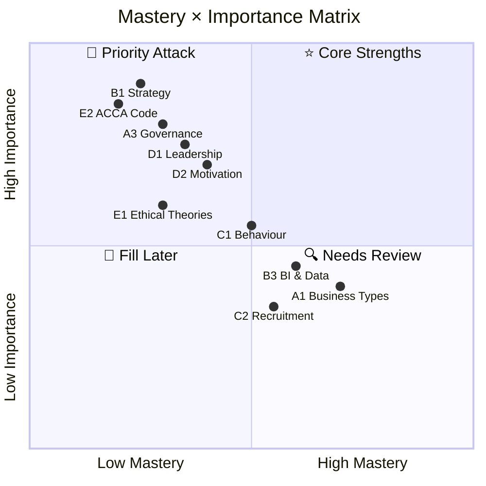

# 📊 Knowledge Dashboard

## ACCA F1 (BT) Mastery Overview

> 💡 **Note**: Current mastery based on initial assessment. Updated as Daryl's discussions deepen. Each node tagged: ⚡Case / ⚠️Comparison / 💬Discussion / ⭐Key

---

## 📈 Module Progress

| Module | Chapters | Notes Done | Discussion Done | Mastery |
|:---|:---:|:---:|:---:|:---:|
| **A** Business Org & Governance | 4 | ░░░░ 0% | ░░░░ 0% | — |
| **B** Strategy & Technology | 4 | ░░░░ 0% | ░░░░ 0% | — |
| **C** HR Management | 6 | ░░░░ 0% | ░░░░ 0% | — |
| **D** Leadership & Management | 3 | ░░░░ 0% | ░░░░ 0% | — |
| **E** Professional Ethics | 3 | ░░░░ 0% | ░░░░ 0% | — |
| **Total** | 20 | 0% | 0% | — |

---

## 🔄 Recent Updates

| Date | Update |
|:---|:---|
| 2026-06-14 | Vault skeleton built, F1 framework initialized |

---

> Return to [[Home|Home]]
