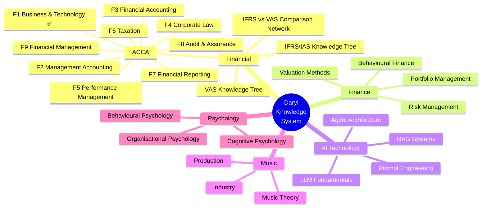
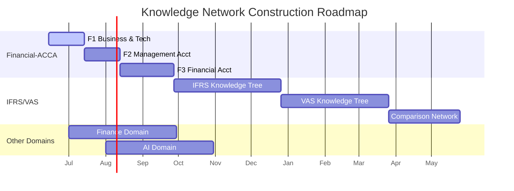

# 🧠 Daryl's Personal Knowledge Network

> *"The value of information lies not in the information itself, but in the relationships between pieces of information."*

---

## 📊 Knowledge Network Overview

---

## 🗺️ Architecture

| Layer | Name | Description |
|:---|:---|:---|
| L1 | **Vault (Knowledge Base)** | Obsidian Markdown files, Git version control |
| L2 | **Bookmark Index** | Quick node lookup by reference number |
| L3 | **Agent Query Layer** | Self middleware, responding to `query_node` from other Agents |
| L4 | **Discussion Layer** | Daryl's discussions → Self async processing → structured notes |

---

## 🔗 Quick Navigation

- 📖 [[Dashboard|Knowledge Dashboard]] — Visual mastery overview
- 📚 [[../01-Financial/ACCA/F1-BT/F1-Home|ACCA F1 Knowledge Tree]] — Active project
- 🏗️ [[../02-Finance/|Finance Domain]]
- 🤖 [[../03-AI-Tech/AI-Tech-Home|AI Technology Domain]]
- 🎵 [[../04-Music/|Music Domain]]
- 🧠 [[../05-Psychology/|Psychology Domain]]
- 📝 [[../Templates/Concept|Concept Template]]
- 🔗 [[Knowledge-Map|Cross-Domain Map]]

---

## 📈 Roadmap

---

> Last updated: 2026-06-14 | Maintained by: Self (恨点小己)
