# 🔗 Cross-Domain Map

ACCA F1 knowledge points and their connections to other domains.

```mermaid
graph TB
    subgraph Financial-ACCA-F1
        A3[Corporate Governance]
        B1[Strategic Management]
        B2[Information Technology]
        C1[Individual Behaviour]
        C2[Recruitment & Selection]
        C3[Diversity & Inclusion]
        C4[Training & Development]
        C5[Performance Appraisal]
        C6[Reward Systems]
        D1[Leadership]
        D2[Motivation Theories]
        D3[Team Dynamics]
        E1[Ethical Theories]
        E2[ACCA Code of Conduct]
        E3[Ethical Conflict]
    end

    subgraph Finance Domain
        INV[Investment Decisions]
        RISK[Risk Management]
    end

    subgraph AI Technology Domain
        LLM[Large Language Models]
        RAG[Retrieval-Augmented Generation]
        AGENT[Agent Architecture]
    end

    subgraph Music Domain
        THEORY[Music Theory]
        PROD[Production]
    end

    subgraph Psychology Domain
        COG[Cognitive Psychology]
        BEHAV[Behavioural Psychology]
        ORG[Organisational Psychology]
    end

    B1 --> INV
    B1 --> RISK
    C1 -.-> LLM
    C5 -.-> AGENT
    D2 -.-> COG
    D2 -.-> BEHAV
    C1 -.-> BEHAV
    C1 -.-> THEORY
    C1 -.-> PROD

    classDef financial fill:#d4e6f1,stroke:#2874a6
    classDef finance fill:#f5e6d3,stroke:#b87333
    classDef ai fill:#d5f5e3,stroke:#27ae60
    classDef music fill:#f5e6f6,stroke:#8e44ad
    classDef psychology fill:#fdedec,stroke:#e74c3c

    class A3,B1,B2,C1,C2,C3,C4,C5,C6,D1,D2,D3,E1,E2,E3 financial
    class INV,RISK finance
    class LLM,RAG,AGENT ai
    class THEORY,PROD music
    class COG,BEHAV,ORG psychology
```

---

## 🔬 Specific Cross-Domain Clues

### 1. Strategic Management → Investment Decisions
- Porter's Five Forces → Industry Analysis → **Valuation Model** industry assumptions
- Ansoff Matrix → Growth Strategy → **DCF Valuation** growth rate assumptions
- ⚡ Example: A Vietnamese manufacturer uses Five Forces to assess new market entry → impacts WACC assumptions

### 2. Individual Behaviour → AI System Design
- Big Five (OCEAN) → User Personality Modeling → **LLM Personalised Prompts**
- Cognitive Dissonance → User Belief Conflicts → **Recommendation Systems** cognitive adaptation
- 💬 Discussion: Does an AI Agent need to understand "cognitive dissonance" to serve users better?

### 3. Motivation Theory → Psychology
- Goal-Setting Theory → Behavioural Change Design (SMART)
- Expectancy Theory → Cognitive Motivation Models (E×I×V)
- ⚠️ Comparison: Extrinsic motivation (rewards) vs Intrinsic motivation (self-determination)
- Big Five (OCEAN) → Personality Psychology foundation

### 4. Organisational Culture → Music
- Hofstede's Cultural Dimensions → Cross-Cultural Music Aesthetics
- High Individualism → Strong solo traditions? High Collectivism → Strong ensemble/choir traditions?
- 💬 Open question: Is there a quantifiable relationship between cultural dimensions and musical styles?

---

> Return to [[Home|Home]]
