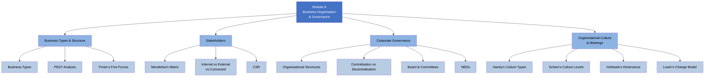

# A — Business Organisation, Structure & Governance (20%)

## 📑 Chapter List

| Ref | Chapter | Core Concepts | Exam Weight | Status |
|:---|:---|:---|:---:|:---:|
| A1 | [[A1-Business-Types|Business Types & Structure]] | Sole Trader / Partnership / Ltd / PEST / Five Forces | 5% | ⬜ |
| A2 | [[A2-Stakeholders|Stakeholders]] | Mendelow / CSR / Stakeholder Conflict | 5% | ⬜ |
| A3 | [[A3-Governance|Corporate Governance]] | Board / NEDs / Committees | 5% | ⬜ |
| A4 | [[A4-Culture|Culture & Meetings]] | Handy / Schein / Hofstede / Lewin | 5% | ⬜ |

---

## 🔗 Cross-Module Links

- A2 (Stakeholders) + E2 (ACCA Code) → Ethical decisions in stakeholder conflicts
- A3 (Governance) + E1 (Ethics) → Tone at the top / Board independence
- A4 (Culture) + D1 (Leadership) → Leadership style-culture fit

---

> Return to [[../F1-Home|F1 Home]]
