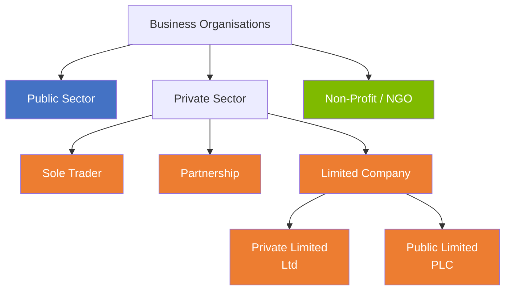
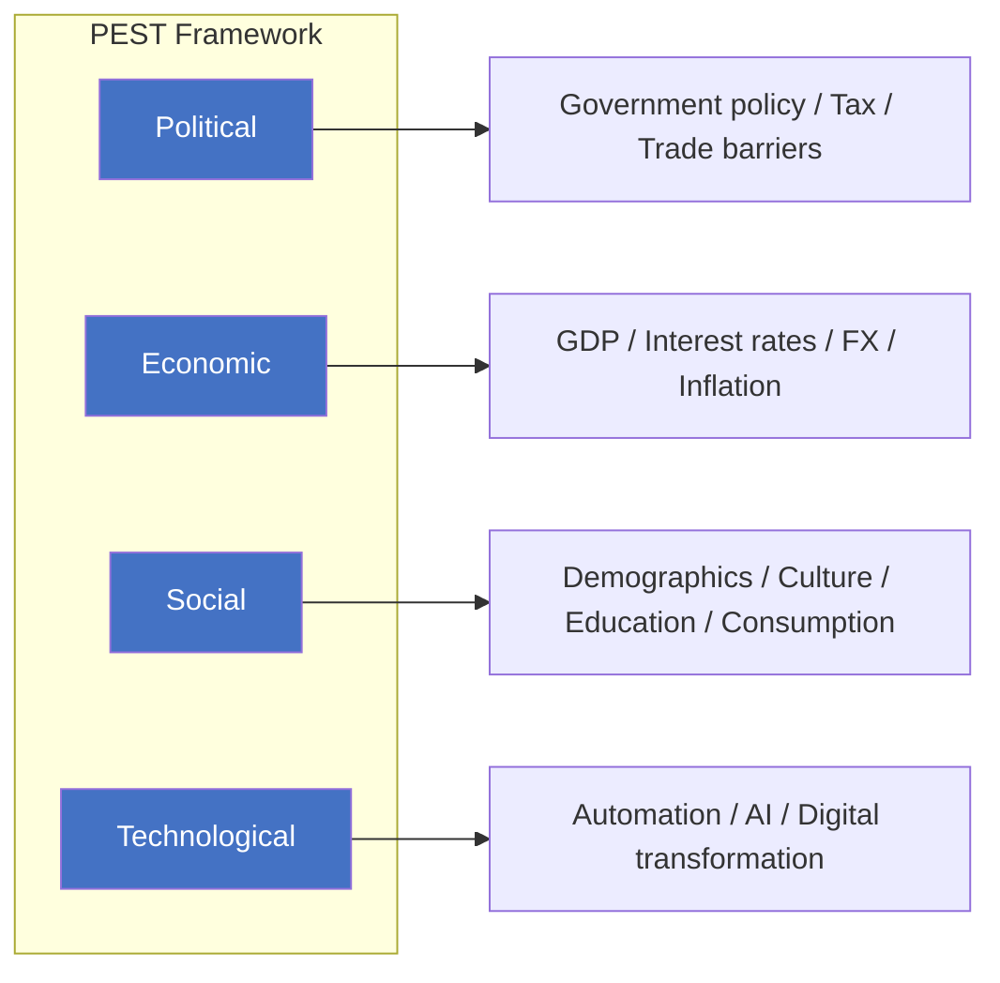
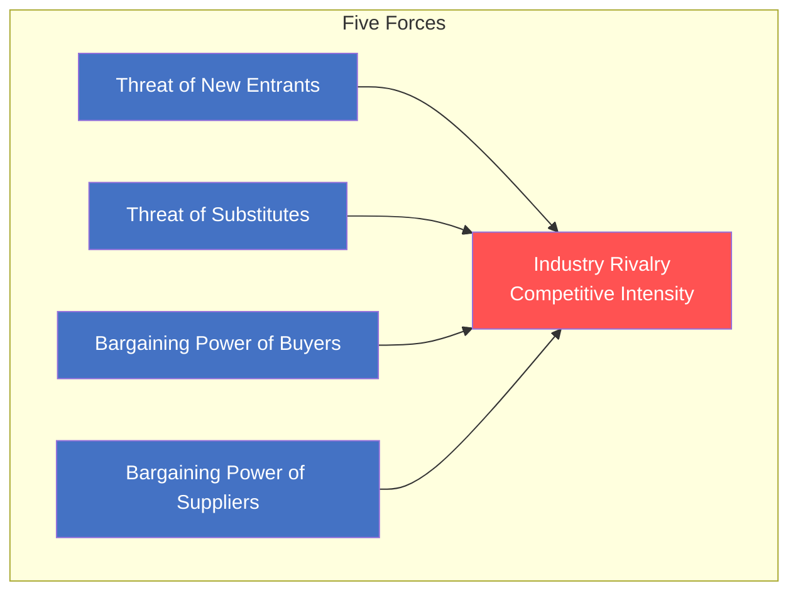

# A1 — Business Types & Structure

> ⭐ Foundational, high-frequency | Panoramic classification of business organisations

---

## 📖 Types of Business Organisation

### Detailed Comparison

| Feature | Sole Trader | Partnership | Private Ltd (Ltd) | Public Ltd (PLC) |
|:---|:---|:---|:---|:---|
| **Owners** | 1 person | 2-20 (typical) | 1+ shareholders | 2+ shareholders |
| **Liability** | Unlimited | Unlimited (usually) | Limited | Limited |
| **Capital Raising** | Low | Medium | Medium-High | High (stock market) |
| **Regulation** | Minimal | Low | Medium | High (public disclosure) |
| **Transfer of Ownership** | Difficult | Requires partner consent | Relatively easy | Easy (share market) |
| **Typical Examples** | Small shops, freelancers | Law firms, clinics | Family businesses | Listed companies |

---

## 🌍 Business Environment Analysis

### PEST Analysis

> ⚠️ **Extended version**: PESTLE = PEST + Legal + Environmental

### Porter's Five Forces

| Force | High-Threat Conditions | Low-Threat Conditions |
|:---|:---|:---|
| **New Entrants** | Low capital needs, no patents, low brand loyalty | High barriers, strong regulation |
| **Substitutes** | Good value substitutes, low switching costs | No substitutes, high switching costs |
| **Buyers** | Concentrated buyers, standardised products | Fragmented buyers, differentiated products |
| **Suppliers** | Concentrated suppliers, no alternatives | Fragmented suppliers, backward integration possible |
| **Rivalry** | Slow growth, high exit barriers, commoditised | High growth, differentiated, low fixed costs |

---

## 📈 Business Lifecycle

| Stage | Characteristics | Strategic Focus |
|:---|:---|:---|
| Startup | High investment, negative/low profit, validating business model | Product-Market Fit (PMF) |
| Growth | Rapid expansion, revenue growth, brand building | Market share, scaling |
| Maturity | Slowing growth, stable profit, intense competition | Efficiency, cost control |
| Decline | Shrinking market, declining profit | Harvest / Divest / Transform |

---

## 🔗 Links

- Porter's Five Forces → [[../../B-Strategy-Technology/B1-Strategy|B1 Strategic Management]]
- Business Types → F4 Corporate Law (legal structures)
- PEST → F9 Financial Management (macro environment impact on investment)

---

> Return to [[A-Home|Module A Home]]
