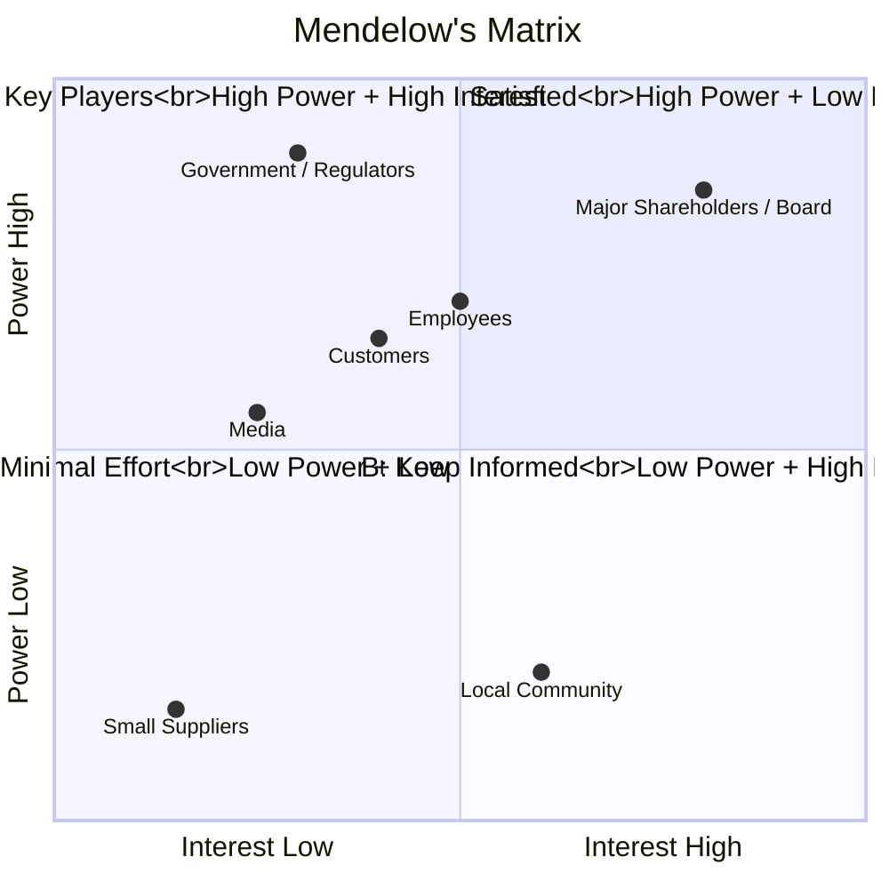
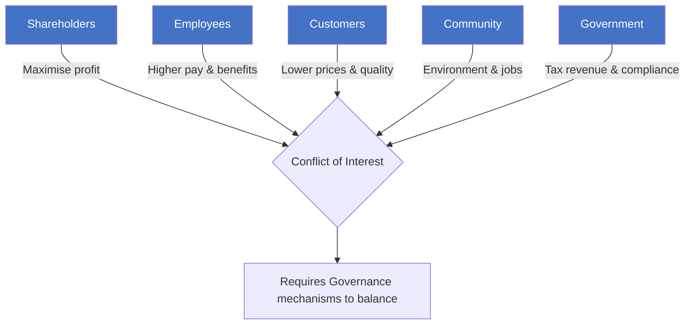

# A2 — Stakeholders

> ⭐ Foundational concept across the entire ACCA syllabus

---

## 📖 Definition

**Stakeholder**: Any individual or group that affects or is affected by an organisation's activities.

Key distinction from **Shareholder**:
- Shareholder = holds equity (financial interest only)
- Stakeholder = all affected groups (broader scope)
- Shareholders are a subset of stakeholders

---

## 🧩 Mendelow's Matrix (Power-Interest Grid)



| Quadrant | Strategy | Typical Stakeholders | Action |
|:---|:---|:---|:---|
| **A: Keep Satisfied** | Meet core demands | Government, large institutional investors | Address their key concerns |
| **B: Keep Informed** | Regular communication | Local community, minority shareholders | Transparent reporting |
| **C: Minimal Effort** | Routine maintenance | Distant suppliers | Standard processes |
| **D: Key Players** | Deep engagement | Major shareholders, core customers, unions | Involve in decision-making |

⚠️ **Note**: Stakeholder positions are dynamic. A community in quadrant B can become a key player (D) after an environmental incident.

---

## 📂 Stakeholder Classification

### Three-Category Model

| Type | Definition | Examples |
|:---|:---|:---|
| **Internal** | Within the organisation | Employees, management, board |
| **Connected** | Contractual/trading relationship | Shareholders, customers, suppliers, banks, creditors |
| **External** | External influence or affected | Government, community, media, pressure groups |

### Primary vs Secondary

- **Primary**: Directly affect or are affected — shareholders, employees, customers, suppliers
- **Secondary**: Indirect influence — media, NGOs, community, government

---

## ⚔️ Stakeholder Conflict



| Conflict Type | Typical Scenario |
|:---|:---|
| Shareholders vs Employees | Downsizing to boost profits vs job security |
| Shareholders vs Customers | Price increases vs customer interests |
| Shareholders vs Community | Closing a loss-making plant vs local employment |
| Short-term vs Long-term | Cutting R&D for current profit vs long-term competitiveness |

---

## 🌱 CSR (Corporate Social Responsibility)

**Carroll's Pyramid of CSR**:

```mermaid
graph TB
    PHIL[Philanthropic<br/>"Be a good corporate citizen"]
    ETH[Ethical<br/>"Do what is right"]
    LEGAL[Legal<br/>"Obey the law"]
    ECON[Economic<br/>"Be profitable"]
    
    PHIL --> ETH --> LEGAL --> ECON
    
    classDef csr fill:#7fba00,color:#fff
    class PHIL,ETH,LEGAL,ECON csr
```

💬 **Daryl Discussion**: CSR practices in Vietnamese companies? Is CSR a cost or a long-term investment?

---

## 🔗 Links

- Mendelow → [[../D-Leadership/D1-Leadership|D1 Leadership]] (stakeholder management is a core leadership function)
- CSR → [[../E-Ethics/E1-Ethical-Considerations|E1 Business Ethics]]
- Stakeholder conflict → [[A3-Governance|A3 Corporate Governance]] (governance exists to balance conflicts)

---

> Return to [[A-Home|Module A Home]]
