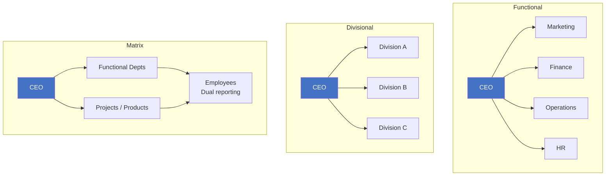
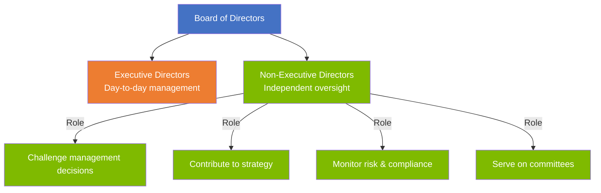

# A3 — Corporate Governance

> ⭐ Key topic | Runs through F1 / F4 / F8

---

## 📖 Organisational Structures



| Structure | Advantages | Disadvantages | Best For |
|:---|:---|:---|:---|
| **Functional** | Specialisation, efficiency | Silos, slow communication | Single product, stable environment |
| **Divisional** | Flexible, responsive | Resource duplication, coordination | Multiple products/markets |
| **Matrix** | Flexible + specialised | Dual reporting chaos, conflict | Project-driven organisations |
| **Network/Flat** | Agile, low cost | Weak control, role ambiguity | Startups, creative organisations |

---

## 📏 Organisational Design Dimensions

### Span of Control vs Levels of Hierarchy

```
Wide span + Few levels              Narrow span + Many levels
(Flat organisation)                 (Tall organisation)

  CEO                                CEO
  ├─ Mgr A  ├─ Mgr B                 ├─ Director A
  ├─ Mgr C  ├─ Mgr D                 │   ├─ Mgr A1
  ├─ Mgr E  ├─ Mgr F                 │   └─ Mgr A2
  └─ Mgr G                           ├─ Director B
                                        ├─ Mgr B1
                                        └─ Mgr B2
```

| Dimension | Wide (Flat) | Narrow (Tall) |
|:---|:---|:---|
| Management layers | Few | Many |
| Communication speed | Fast | Slow (information distortion) |
| Supervision | Loose | Tight |
| Cost | Low | High |
| Employee autonomy | High | Low |

### Centralisation vs Decentralisation

|  | Centralisation | Decentralisation |
|:---|:---|:---|
| Decision-making | Concentrated at top | Distributed across levels |
| Advantages | Consistency, control | Flexibility, rapid response |
| Disadvantages | Slow decisions, top overload | Inconsistency, coordination difficulty |
| Suitable for | Stable environments | Dynamic / localised needs |

---

## 🏛️ Corporate Governance

### Three Core Principles

1. **Transparency** — Open information, traceable decisions
2. **Accountability** — Those who decide, answer
3. **Independence** — Oversight independent from those overseen

### Board of Directors



### Three Key Committees

| Committee | Composition | Responsibilities |
|:---|:---|:---|
| **Audit Committee** | Min 2 NEDs, 1 with financial expertise | Oversee audit, internal controls, risk management |
| **Remuneration Committee** | Min 2 NEDs | Set executive compensation policy |
| **Nomination Committee** | Majority NEDs | Director appointments, succession planning |

⚠️ **Comparison**: Governance vs Management
- Governance = Board's domain — direction, oversight, accountability
- Management = Executive team's domain — daily operations, execution

---

## 🔗 Links

- NED Independence → [[../E-Ethics/E2-Code-of-Conduct|E2 ACCA Code]] (Self-review threat)
- Governance vs Management → [[../D-Leadership/D1-Leadership|D1 Leadership]]
- Committee structure → F8 Audit (Audit Committee is key auditor interface)

---

> Return to [[A-Home|Module A Home]]
