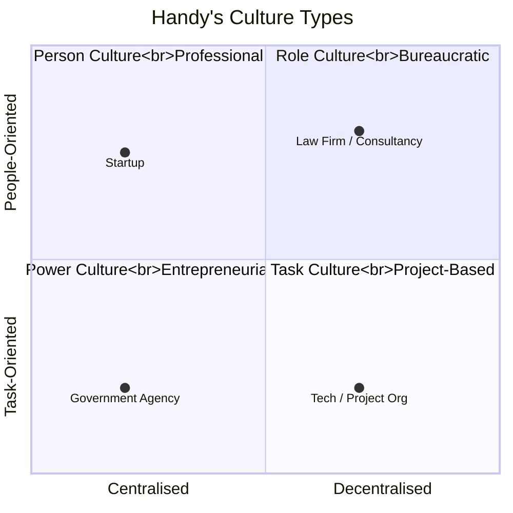

# A4 — Organisational Culture & Meetings

---

## 🎭 Organisational Culture

### Handy's Four Culture Types



| Type | Characteristics | Typical Organisation | Metaphor |
|:---|:---|:---|:---|
| **Power** | Central figure controls everything | Small startups | 🕸️ Spider's web |
| **Role** | Operates by position and rules | Government, large bureaucracies | 🏛️ Greek temple |
| **Task** | Organised around projects and tasks | Consulting, advertising | 📐 Matrix network |
| **Person** | Individuals are the core, organisation serves them | Law firms, clinics, universities | 🌟 Constellation |

---

### Schein's Three Levels of Culture

```mermaid
graph TB
    L1[Level 1: Artifacts<br/>"Visible but hard to decipher"]
    L2[Level 2: Espoused Values<br/>"What is said"]
    L3[Level 3: Basic Assumptions<br/>"Unconscious, taken for granted"]
    
    L1 --> L2 --> L3
    
    L1 -.- E1["e.g. Dress code / Office layout / Logo"]
    L2 -.- E2["e.g. Mission statement / 'We value innovation'"]
    L3 -.- E3["e.g. Attitude toward authority / Risk appetite / Time orientation"]
    
    classDef level fill:#4472c4,color:#fff
    class L1,L2,L3 level
```

---

### Hofstede's Cultural Dimensions

| Dimension | Definition | High Score Examples | Low Score Examples |
|:---|:---|:---|:---|
| **Power Distance** | Acceptance of unequal power distribution | China, Vietnam | Denmark, Sweden |
| **Individualism vs Collectivism** | Individual priority vs group priority | USA, UK | Vietnam, Japan |
| **Masculinity vs Femininity** | Competition/achievement vs cooperation/quality of life | Japan | Sweden |
| **Uncertainty Avoidance** | Tolerance for ambiguity | Germany, France | Singapore |
| **Long-term Orientation** | Long-term planning vs short-term results | China, Vietnam | USA |
| **Indulgence vs Restraint** | Freedom to gratify desires | Mexico | Russia |

💬 **Daryl Discussion**: Where do Vietnamese companies (high Power Distance + Collectivism) clash with Anglo-American models in ACCA textbooks (low Power Distance + Individualism)?

---

## 🔄 Culture Change — Lewin's 3-Stage Model

```mermaid
graph LR
    U[Unfreeze<br/>"Break the status quo<br/>Create need for change"]
    C[Change<br/>"Implement new behaviours<br/>New processes"]
    R[Refreeze<br/>"Crystallise new culture<br/>Make it the new normal"]
    
    U --> C --> R
    
    classDef stage fill:#7fba00,color:#fff
    class U,C,R stage
```

| Stage | Key Actions | Risks |
|:---|:---|:---|
| **Unfreeze** | Identify need for change, communicate urgency, build support | Resistance, denial |
| **Change** | Training, new processes, pilots, quick wins | Chaos, regression |
| **Refreeze** | Institutionalise, reward new behaviours, embed in culture | Failure to crystallise |

---

## 📋 Committees & Meetings

### Committee Types

| Type | Characteristics | Example |
|:---|:---|:---|
| **Standing** | Permanent, ongoing | Audit Committee |
| **Ad hoc** | Temporary, specific task | M&A task force |
| **Executive** | Decision-making authority | Executive Committee |
| **Advisory** | Recommend, no decision authority | Expert advisory panel |

### Key Meeting Terminology

| Term | Meaning |
|:---|:---|
| **Quorum** | Minimum attendance for valid meeting |
| **Agenda** | Meeting schedule |
| **Minutes** | Meeting record |
| **Motion** | Formal proposal |
| **Resolution** | Decision (Ordinary: >50% / Special: ≥75%) |
| **Proxy** | Vote by representative |

---

## 🔗 Links

- Hofstede → [[../C-HRM/C3-Diversity|C3 Diversity]]
- Lewin's Model → [[../B-Strategy-Technology/B1-Strategy|B1 Strategic Change]]
- Handy → [[../D-Leadership/D1-Leadership|D1 Leadership style-culture fit]]

---

> Return to [[A-Home|Module A Home]]
