# B — Business Strategy & Technology (25%)

```mermaid
graph TB
    B[Module B<br/>Strategy & Technology]
    B --> B1[Strategic Management]
    B --> B2[Information Technology]
    B --> B3[Business Intelligence]
    B --> B4[Project Management]
    
    B1 --> B1a[SWOT]
    B1 --> B1b[Ansoff Matrix]
    B1 --> B1c[Porter's Generic Strategies]
    B1 --> B1d[BCG Matrix]
    
    B2 --> B2a[Big Data 4V]
    B2 --> B2b[Cloud Computing]
    B2 --> B2c[Cybersecurity]
    B2 --> B2d[GDPR]
    
    B3 --> B3a[BI vs Analytics]
    B3 --> B3b[Descriptive / Diagnostic / Predictive / Prescriptive]
    B3 --> B3c[KPI & Balanced Scorecard]
    
    B4 --> B4a[Project Lifecycle]
    B4 --> B4b[Triple Constraint]
    B4 --> B4c[Critical Path Method]
    B4 --> B4d[Risk Management]
    
    classDef root fill:#7fba00,color:#fff
    classDef level1 fill:#a8d957,color:#000
    classDef level2 fill:#d4ed9b,color:#000
    
    class B root
    class B1,B2,B3,B4 level1
    class B1a,B1b,B1c,B1d,B2a,B2b,B2c,B2d,B3a,B3b,B3c,B4a,B4b,B4c,B4d level2
```

## 📑 Chapter List

| Ref | Chapter | Core Concepts | Exam Weight | Status |
|:---|:---|:---|:---:|:---:|
| B1 | [[B1-Strategy|Strategic Management]] | SWOT / Ansoff / Porter / BCG | 7% | ⬜ |
| B2 | [[B2-IT|Information Technology]] | Big Data / Cloud / Security / GDPR | 6% | ⬜ |
| B3 | [[B3-BI-Data|BI & Data Analytics]] | BI / Analytics / KPI / BSC | 6% | ⬜ |
| B4 | [[B4-Project-Mgmt|Project Management]] | Lifecycle / Triple Constraint / CPM | 6% | ⬜ |

---

## 🔗 Cross-Module Links

- B1 (Strategy) + F9 (Financial Management) → How strategy drives valuation
- B3 (BI & Data) + AI Technology Domain → Intersection of analytics and LLM/RAG
- B4 (Projects) + D3 (Teams) → Project team management

---

> Return to [[../F1-Home|F1 Home]]
