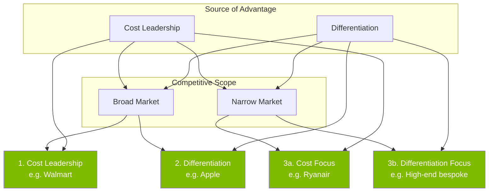
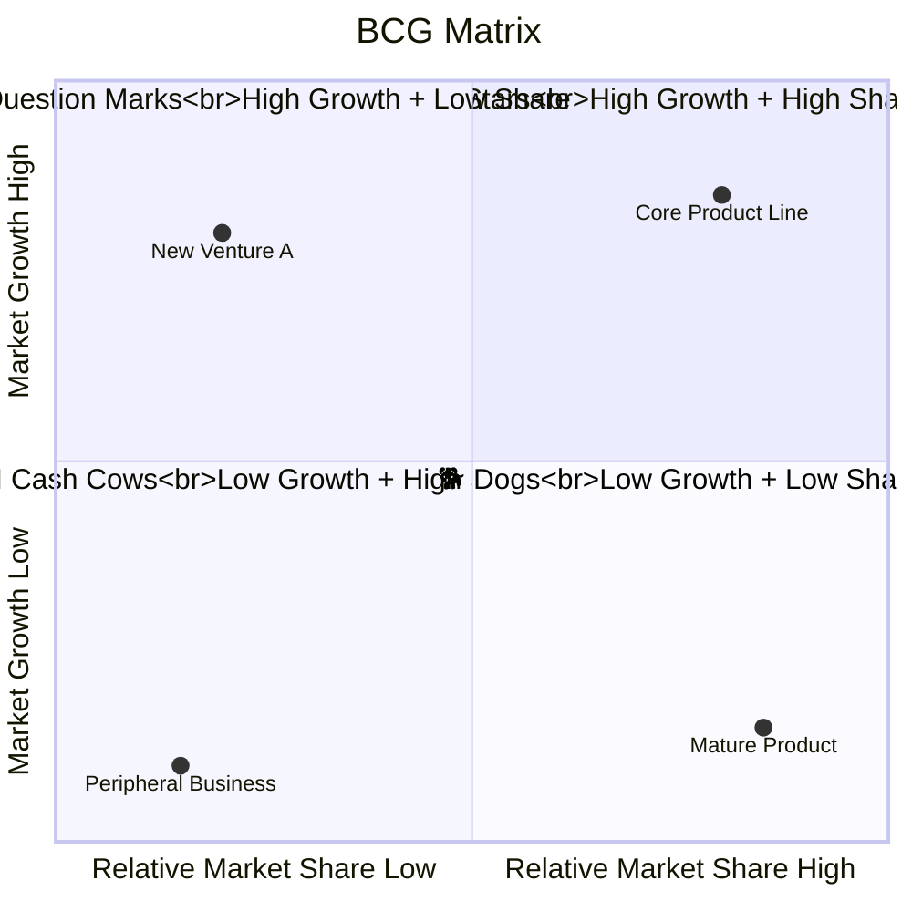

# B1 — Strategic Management

> ⭐ Key module | F1 core, continuously referenced in F5/F7/F9

---

## 📖 Strategic Hierarchy

```mermaid
graph TB
    CS[Corporate Strategy<br/>"What business to be in?"]
    BS[Business Strategy<br/>"How to compete?"]
    FS[Functional Strategy<br/>"How do functions support?"]
    OS[Operational Strategy<br/>"How to execute daily?"]
    
    CS --> BS --> FS --> OS
    
    CS -.->|Example| CS1["Enter Vietnam market"]
    BS -.->|Example| BS1["Cost leadership strategy"]
    FS -.->|Example| FS1["Localised supply chain"]
    OS -.->|Example| OS1["Daily production scheduling"]
    
    classDef strat fill:#7fba00,color:#fff
    classDef example fill:#d4ed9b,color:#000
    
    class CS,BS,FS,OS strat
    class CS1,BS1,FS1,OS1 example
```

| Level | Decision Scope | Decision Maker | Time Horizon | Example Question |
|:---|:---|:---|:---|:---|
| Corporate | What business? Which markets? | Board / CEO | 5-10 years | "Should we enter Vietnam?" |
| Business | How to compete in chosen markets? | BU Head / VP | 3-5 years | "Price war or differentiation?" |
| Functional | How do departments support? | Dept Director | 1-3 years | "Should supply chain localise?" |
| Operational | Daily execution | Frontline Managers | Monthly/Quarterly | "How to optimise this week's schedule?" |

---

## 📊 SWOT Analysis

```mermaid
quadrantChart
    title SWOT Matrix
    x-axis "Negative" --> "Positive"
    y-axis "Internal" --> "External"
    quadrant-1 "Strengths<br/>Internal Positives"
    quadrant-2 "Opportunities<br/>External Positives"
    quadrant-3 "Weaknesses<br/>Internal Negatives"
    quadrant-4 "Threats<br/>External Negatives"
    "Brand Recognition": [0.7, 0.3]
    "Technology Patents": [0.8, 0.2]
    "Vietnam Low Labour Costs": [0.7, 0.8]
    "RCEP Tariff Benefits": [0.6, 0.9]
    "Supply Chain Dependency on China": [-0.5, 0.3]
    "Low R&D Investment": [-0.7, 0.2]
    "VND Exchange Rate Volatility": [-0.6, 0.7]
    "Rising ESG Compliance Costs": [-0.4, 0.8]
```

**TOWS Strategic Matrix** (Actionable SWOT)

|  | Strengths (S) | Weaknesses (W) |
|:---|:---|:---|
| **Opportunities (O)** | **SO Strategy**: Use strengths to seize opportunities | **WO Strategy**: Fix weaknesses to seize opportunities |
| **Threats (T)** | **ST Strategy**: Use strengths to counter threats | **WT Strategy**: Reduce weaknesses to avoid threats |

---

## 🎯 Porter's Generic Strategies



⚠️ **Porter's Warning**: **"Stuck in the middle"** — neither cost leader nor differentiator, most vulnerable to failure.

💬 **Daryl Discussion**: Are most Vietnamese manufacturers "stuck in the middle"? Any successful breakouts?

---

## 📈 Ansoff Matrix (Growth Matrix)

|  | Existing Products | New Products |
|:---|:---|:---|
| **Existing Markets** | **Market Penetration** (Risk: ★) | **Product Development** (Risk: ★★★) |
| **New Markets** | **Market Development** (Risk: ★★★) | **Diversification** (Risk: ★★★★★) |

- **Market Penetration**: Sell more existing products in existing markets (pricing/promotion/channel)
- **Market Development**: Sell existing products into new markets (enter Vietnam market)
- **Product Development**: Launch new products in existing markets (iPhone → Apple Watch)
- **Diversification**: New products + new markets (highest risk, e.g. Amazon → AWS)

⚡ **Vietnam Example**: Vinamilk from dairy → beverages → international markets — how to map its Ansoff path?

---

## 🔵 BCG Matrix (Boston Consulting Group)



| Quadrant | Strategy | Cash Flow |
|:---|:---|:---|
| ⭐ Stars | Invest for growth → become Cash Cow | Consumes capital |
| ❓ Question Marks | Selective investment (some → Star, some → divest) | Needs capital |
| 🐄 Cash Cows | "Milk" — maintain, generate cash | Generates cash flow |
| 🐕 Dogs | Divest or liquidate | May consume resources |

---

## 🔗 Cross-Module Links

- Porter's Five Forces ← A1 Business Types (different types face different forces)
- Strategy Hierarchy → C5 Performance Appraisal (different levels have different KPIs)
- Ansoff → Finance Domain **DCF Valuation** (growth assumptions depend on market/product expansion path)
- BCG → **Portfolio Management** (Finance domain portfolio theory shares structural similarity)

---

## 📝 Daryl's Notes

> *Reserved for Daryl's discussion recordings / handwritten notes*

---

> Return to [[B-Home|Module B Home]] | [[../../F1-Home|F1 Home]]
