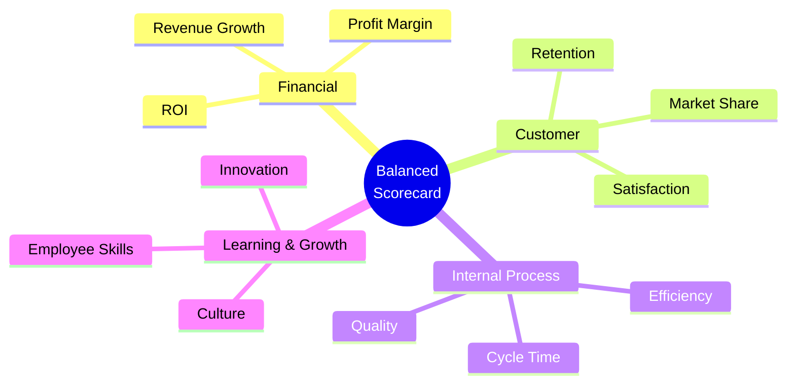

# B3 — Business Intelligence & Data Analytics

> 🔗 Direct intersection with AI Technology Domain

---

## 📊 BI vs Data Analytics

|  | Business Intelligence | Data Analytics |
|:---|:---|:---|
| **Focus** | "What happened?" | "Why did it happen? What will happen next?" |
| **Time** | Past and present | Past → Present → Future |
| **Output** | Dashboards, reports | Insights, predictions, recommendations |
| **Users** | Management | Analysts, data scientists |

---

## 🔢 Four Levels of Data Analytics

```mermaid
graph TB
    DESC[Descriptive<br/>"What happened?"]
    DIAG[Diagnostic<br/>"Why did it happen?"]
    PRED[Predictive<br/>"What will happen?"]
    PRES[Prescriptive<br/>"What should we do?"]
    
    DESC --> DIAG --> PRED --> PRES
    
    DESC -.- EX1["Sales dropped 10% this month"]
    DIAG -.- EX2["Due to competitor price drop + supply chain disruption"]
    PRED -.- EX3["Forecast: continue declining 5-8% next quarter"]
    PRES -.- EX4["Recommend: Adjust pricing, activate backup supplier"]
    
    classDef analytics fill:#7fba00,color:#fff
    class DESC,DIAG,PRED,PRES analytics
```

| Level | Question | Complexity | Value |
|:---|:---|:---|:---|
| Descriptive | What happened? | ★ | ⭐⭐ |
| Diagnostic | Why did it happen? | ★★ | ⭐⭐⭐ |
| Predictive | What will happen? | ★★★ | ⭐⭐⭐⭐ |
| Prescriptive | What should we do? | ★★★★ | ⭐⭐⭐⭐⭐ |

---

## 📈 KPI & Balanced Scorecard

### SMART Principles for KPIs

| Letter | Meaning | Counter-Example |
|:---|:---|:---|
| **S**pecific | Concrete and clear | "Improve customer satisfaction" ❌ |
| **M**easurable | Quantifiable | "Get better" ❌ |
| **A**chievable | Attainable | Unrealistic targets ❌ |
| **R**elevant | Linked to strategy | Unrelated metrics ❌ |
| **T**ime-bound | Has a deadline | No end date ❌ |

### Balanced Scorecard (BSC) — Four Perspectives



💡 **Why "Balanced"**: Traditional finance-only metrics are lagging indicators. BSC adds Customer / Process / Growth as leading indicators, balancing short-term and long-term, financial and non-financial.

---

## 🗄️ Information System Types

| System | Full Name | Purpose | User Level |
|:---|:---|:---|:---|
| **TPS** | Transaction Processing System | Daily transaction processing | Operational |
| **MIS** | Management Information System | Management reporting | Middle management |
| **DSS** | Decision Support System | Decision analysis | Senior management |
| **EIS** | Executive Information System | Strategic dashboards | Executives |
| **ES** | Expert System | Simulate expert decisions | Specialists |

---

## 🔗 Links

- BI Four Levels → AI Technology Domain (LLM can achieve Predictive + Prescriptive)
- BSC → [[B1-Strategy|B1 Strategic Management]] (strategy execution measurement)
- KPI → [[../C-HRM/C5-Appraisal|C5 Performance Appraisal]]
- Data Mining → AI Technology Domain RAG Systems

---

> Return to [[B-Home|Module B Home]]
