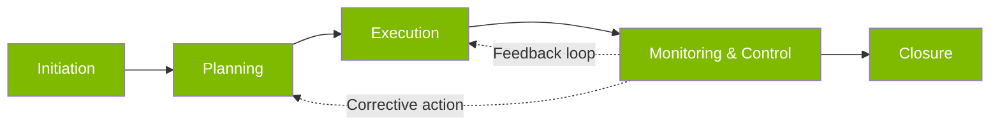
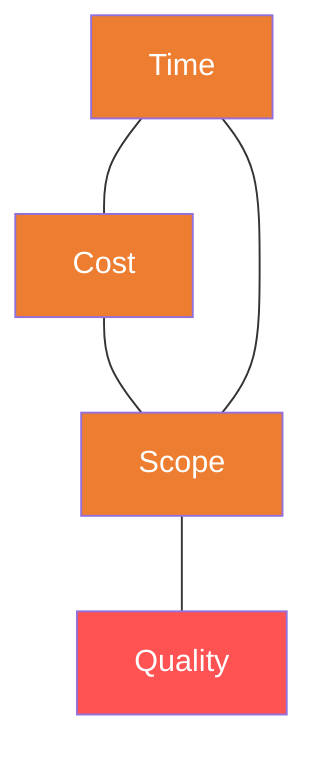
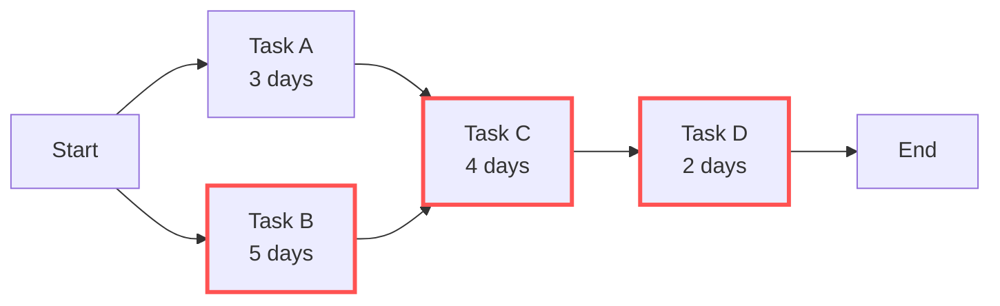

# B4 — Project Management

---

## 📐 Project vs BAU (Business As Usual)

| Feature | Project | BAU (Ongoing Operations) |
|:---|:---|:---|
| **Nature** | Temporary (definite start & end) | Ongoing (continuous) |
| **Output** | Unique (one-off deliverable) | Repetitive |
| **Team** | Assembled temporarily | Permanent team |
| **Budget** | One-off | Annual budget |
| **Risk** | High (greater uncertainty) | Relatively predictable |

---

## 🔄 Project Lifecycle



---

## 🔺 Triple Constraint



> ⚠️ **Iron Triangle Law**: Time, cost, and scope are mutually constraining. Changing one inevitably affects the others. Quality is determined by all three.

---

## 📊 Project Management Tools

### Gantt Chart

```
Task A: ████████░░░░░░░░░░░░░░
Task B: ░░░░██████████░░░░░░░░
Task C: ░░░░░░░░████████████░░
Task D: ░░░░░░░░░░░░░░████████
```

### Critical Path Method (CPM)



- **Critical Path**: Longest path through the project = minimum completion time
- In this example: Start → B(5) → C(4) → D(2) = 11 days (critical path)
- **Float/Slack**: Time a non-critical task can be delayed (Task A has 2 days of float)

---

## 🎯 Project Risk Management


### Risk Response Strategies (TARA Framework)

| Strategy | Meaning | Appropriate For |
|:---|:---|:---|
| **Transfer** | Shift risk (insurance, outsourcing) | High impact, low probability |
| **Avoid** | Eliminate the risk entirely | High impact, high probability |
| **Reduce** | Mitigate likelihood or impact | Medium impact |
| **Accept** | Acknowledge and reserve contingency | Low impact |

---

## 🌀 Agile vs Waterfall

|  | Waterfall | Agile |
|:---|:---|:---|
| **Approach** | Linear sequential | Iterative incremental |
| **Requirements** | Defined upfront | Flexible, evolving |
| **Delivery** | Single final delivery | Continuous small batches |
| **Best For** | Clear requirements, low change | Uncertain requirements, rapid change |
| **User Involvement** | Start and end only | Continuous throughout |

---

## 🔗 Links

- Project Teams → [[../D-Leadership/D3-Teams|D3 Team Dynamics]]
- Risk Management → Finance Domain Risk Management
- Stakeholder Management → [[../A-Business-Organisation/A2-Stakeholders|A2 Stakeholders]]
- Agile → AI Technology Domain (agile LLM application development)

---

> Return to [[B-Home|Module B Home]]
