# C — Human Resource Management (20%)

```mermaid
graph TB
    C[Module C<br/>Human Resource<br/>Management]
    C --> C1[Individual & Group Behaviour]
    C --> C2[Recruitment & Selection]
    C --> C3[Diversity & Inclusion]
    C --> C4[Training & Development]
    C --> C5[Performance Appraisal]
    C --> C6[Reward Systems]
    
    C1 --> C1a[Big Five OCEAN]
    C1 --> C1b[Tuckman's Model]
    C1 --> C1c[Groupthink & Social Loafing]
    
    C2 --> C2a[Job Analysis → Description → Person Spec]
    C2 --> C2b[Selection Methods & Validity]
    
    C3 --> C3a[Diversity vs Inclusion]
    C3 --> C3b[Unconscious Bias]
    
    C4 --> C4a[Training Needs Analysis]
    C4 --> C4b[Kirkpatrick 4 Levels]
    
    C5 --> C5a[Appraisal Methods]
    C5 --> C5b[360-Degree Feedback]
    
    C6 --> C6a[Financial vs Non-Financial]
    C6 --> C6b[Total Reward Concept]
    
    classDef root fill:#ed7d31,color:#fff
    classDef level1 fill:#f4a460,color:#000
    classDef level2 fill:#fad4a8,color:#000
    
    class C root
    class C1,C2,C3,C4,C5,C6 level1
    class C1a,C1b,C1c,C2a,C2b,C3a,C3b,C4a,C4b,C5a,C5b,C6a,C6b level2
```

## 📑 Chapter List

| Ref | Chapter | Core Concepts | Exam Weight | Status |
|:---|:---|:---|:---:|:---:|
| C1 | [[C1-Behaviour|Individual & Group Behaviour]] | Big Five / Tuckman / Groupthink | 4% | ⬜ |
| C2 | [[C2-Recruitment|Recruitment & Selection]] | Job Analysis / Selection / Validity | 3% | ⬜ |
| C3 | [[C3-Diversity|Diversity & Inclusion]] | Inclusion / Bias / Quota | 3% | ⬜ |
| C4 | [[C4-Training|Training & Development]] | TNA / Kirkpatrick / CPD | 3% | ⬜ |
| C5 | [[C5-Appraisal|Performance Appraisal]] | 360° / BARS / PIP | 3% | ⬜ |
| C6 | [[C6-Reward|Reward Systems]] | Total Reward / Pay Structures | 4% | ⬜ |

---

## 🔗 Cross-Module Links

- C1 (Big Five) + AI Domain → Personality modeling & LLM personalisation
- C4 (Training) + D2 (Motivation) → How training motivates employees
- C5 (Appraisal) + D2 (Goal-Setting) → Performance appraisal & goal alignment
- C6 (Reward) + D2 (Herzberg) → Is pay a Hygiene factor or Motivator?

---

> Return to [[../F1-Home|F1 Home]]
