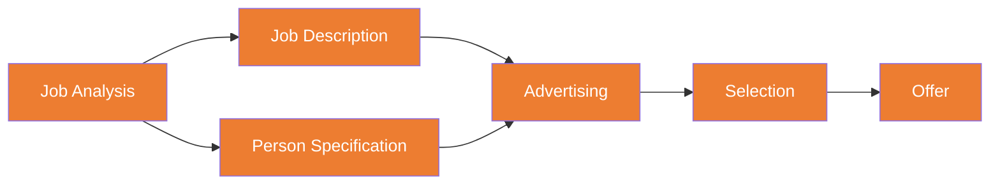

# C2 — Recruitment & Selection

---

## 📋 Recruitment Process

| Document | Content | Focus |
|:---|:---|:---|
| **Job Description** | Tasks, duties, reporting relationships | What the job does |
| **Person Specification** | Required skills, experience, qualifications, traits | Who can do it |

---

## ↔️ Internal vs External Recruitment

|  | Internal | External |
|:---|:---|:---|
| **Advantages** | Lower cost, cultural familiarity, motivates staff | New ideas, new skills, larger talent pool |
| **Disadvantages** | "Inbreeding", limited options, internal politics | Higher cost, cultural adaptation risk, longer process |
| **Best For** | Existing talent pool, key retention needed | New skills needed, organisational change |

---

## 🎯 Selection Methods

| Method | Validity | Cost | Assessment |
|:---|:---|:---|:---|
| **Structured Interview** | ⭐⭐⭐⭐ | Medium | Most common; structured >> unstructured |
| **Assessment Centre** | ⭐⭐⭐⭐⭐ | High | Comprehensive, highest validity |
| **Psychometric Tests** | ⭐⭐⭐ | Medium | Tests ability/personality; watch for legal risks |
| **Work Sample** | ⭐⭐⭐⭐ | Medium | Directly assesses actual ability |
| **References** | ⭐⭐ | Low | Authenticity questionable |
| **Unstructured Interview** | ⭐ | Low | Highly subjective, lowest validity |

⚠️ **Validity vs Reliability**:
- **Validity** = Does it measure what it claims to? (predicts job performance?)
- **Reliability** = Are results consistent? (same candidate, same result?)

---

## 🚫 Selection Biases

| Bias | Manifestation |
|:---|:---|
| **Confirmation Bias** | Formed an impression from CV, interview merely seeks to confirm |
| **Halo Effect** | Attractive/prestigious-school candidate → assume everything is good |
| **Similarity Bias** | Prefer candidates similar to oneself (same school/hometown/hobbies) |
| **Contrast Effect** | Previous candidate was terrible → overrate an average candidate |
| **First Impression** | Decision made in the first 30 seconds |

---

## 🔗 Links

- Selection Biases → [[C1-Behaviour|C1 Perception Biases]]
- Psychometric Tests → [[C1-Behaviour|C1 Big Five Personality Assessment]]
- Internal vs External → [[../D-Leadership/D2-Motivation|D2 Motivation Theories]]

---

> Return to [[C-Home|Module C Home]]
