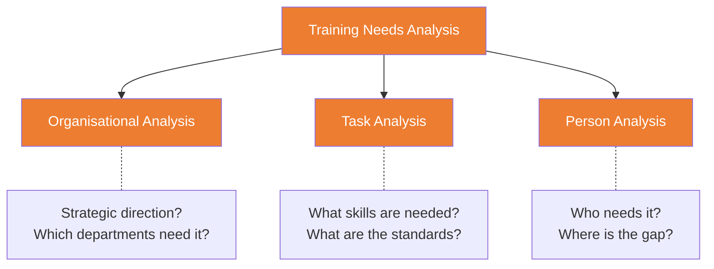

# C4 — Training & Development

---

## 🎓 Training vs Development vs Education

|  | Training | Development | Education |
|:---|:---|:---|:---|
| **Focus** | Current job skills | Future career growth | General knowledge |
| **Time Horizon** | Short-term | Medium-to-long term | Long-term |
| **Orientation** | Task-oriented | Person-oriented | Subject-oriented |
| **Example** | Excel training | Leadership development programme | MBA |

---

## 🔍 Training Needs Analysis (TNA)



---

## 📚 Training Methods

| Method | Type | Advantages | Disadvantages |
|:---|:---|:---|:---|
| **On-the-Job** | In-role | Practical, immediate | May not be standardised |
| **Off-the-Job** | Away from role | Systematic, focused | Detached from reality |
| **E-learning** | Online | Flexible, scalable | Requires self-discipline |
| **Coaching** | One-to-one | Personalised | High cost |
| **Mentoring** | Guidance | Experience transfer | Pairing can be difficult |
| **Job Rotation** | Cross-role | Comprehensive | Lacks depth |
| **Secondment** | Temporary assignment | Broadens perspective | Organisationally complex |

⚠️ **Coaching vs Mentoring**:
- Coaching = Short-term, task-oriented, not necessarily same profession
- Mentoring = Long-term, career development, typically senior in same field

---

## 📊 Kirkpatrick's 4-Level Training Evaluation

```mermaid
graph TB
    L1[Level 1: Reaction<br/>"Did they like it?"]
    L2[Level 2: Learning<br/>"Did they learn?"]
    L3[Level 3: Behaviour<br/>"Do they apply it at work?"]
    L4[Level 4: Results<br/>"Did it impact the business?"]
    
    L1 --> L2 --> L3 --> L4
    
    classDef level fill:#ed7d31,color:#fff
    class L1,L2,L3,L4 level
```

| Level | Measures | Method | Difficulty |
|:---|:---|:---|:---|
| 1 Reaction | Satisfaction | Questionnaire | ★ |
| 2 Learning | Knowledge/skill gain | Pre/post tests | ★★ |
| 3 Behaviour | Behaviour change | Observation / 360 feedback | ★★★ |
| 4 Results | Business impact | ROI calculation | ★★★★ |

⚠️ **Corporate reality**: Most organisations only track to Level 1-2. Level 4 (ROI of Training) is most desired but hardest to measure.

---

## 📜 CPD (Continuous Professional Development)

- ACCA requires all members to complete annual CPD
- Purpose: Maintain ongoing professional competence
- Formats: Training, seminars, self-study, publishing articles, etc.

---

## 🔗 Links

- Training → [[C5-Appraisal|C5 Performance Appraisal]] (appraisal identifies training needs)
- TNA → [[../B-Strategy-Technology/B1-Strategy|B1 Strategic Management]] (training aligned to strategy)
- Kirkpatrick L3 → [[../D-Leadership/D2-Motivation|D2 Motivation Theories]]

---

> Return to [[C-Home|Module C Home]]
