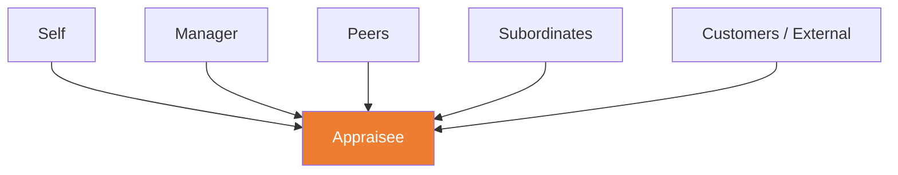

# C5 — Performance Appraisal

---

## 🎯 Purposes of Performance Appraisal

| Purpose | Description |
|:---|:---|
| **Development** | Identify strengths and improvement areas → create development plans |
| **Reward** | Inform pay, bonus, promotion decisions |
| **Feedback** | Let employees know how they are doing |
| **Motivation** | Goal-setting and recognition drive motivation |
| **Documentation** | Provide basis for HR decisions (promotion/termination) |

---

## 📋 Appraisal Methods

### By Assessment Basis

| Method | Basis | Pros | Cons |
|:---|:---|:---|:---|
| **Trait-Based** | Personal traits (attitude, initiative) | Simple | Highly subjective |
| **Behaviour-Based** | Actions (what they did) | Observable | High recording effort |
| **Results-Based** | Outcomes (what they achieved) | Objective | Ignores process |
| **Competency-Based** | Holistic capabilities | Comprehensive | Complex |

### BARS (Behaviorally Anchored Rating Scales)

> Anchors ratings to specific behavioural descriptions, reducing subjectivity

Example: "Customer Service" dimension
- 1: "Ignores customer complaints"
- 3: "Follows procedure to handle complaints"
- 5: "Anticipates customer needs and resolves issues proactively"

---

## 🔄 360-Degree Feedback

| Advantages | Disadvantages |
|:---|:---|
| Multi-perspective, comprehensive | Can become a "popularity contest" |
| Reduces single-rater bias | May be dishonest if tied to compensation |
| Promotes self-awareness | Anonymity can be abused |

---

## ⚠️ Appraisal Biases

| Bias | Description |
|:---|:---|
| **Leniency** | Rating too high (everyone gets top marks) |
| **Strictness** | Rating too low (no one is good enough) |
| **Central Tendency** | Rating everyone in the middle |
| **Recency Effect** | Recent performance dominates overall assessment |
| **Halo Effect** | One strength inflates all ratings |
| **Horns Effect** | One weakness deflates all ratings |

💡 **Mitigation**: Continuous recording (not year-end recall) + BARS anchoring + calibration meetings

---

## 📉 PIP (Performance Improvement Plan)

- Formal written document
- Specifies improvement targets, timeline, support measures
- ⚠️ Debate: Is it a genuine improvement tool, or "pre-termination documentation"?

---

## 🔗 Links

- Appraisal → [[C4-Training|C4 Training Needs Identification]]
- Goal-Setting → [[../D-Leadership/D2-Motivation|D2 Goal-Setting Theory]]
- BARS → [[../D-Leadership/D2-Motivation|D2 Expectancy Theory]]

---

> Return to [[C-Home|Module C Home]]
