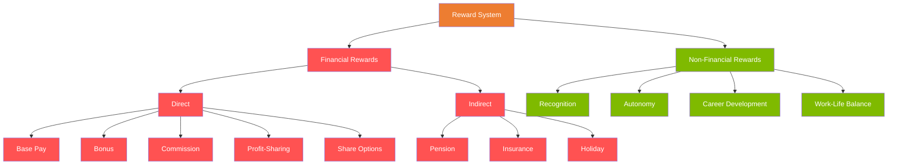

# C6 — Reward Systems

---

## 💰 Reward Classification

---

## ↔️ Intrinsic vs Extrinsic Rewards

|  | Intrinsic | Extrinsic |
|:---|:---|:---|
| **Source** | The work itself | External to the work |
| **Examples** | Achievement, mastery, meaning | Salary, bonus, benefits |
| **Durability** | More enduring | Subject to adaptation (devaluation) |
| **Theory** | Herzberg Motivator | Herzberg Hygiene Factor |

⚠️ **Overjustification Effect**: Excessive extrinsic rewards can "crowd out" intrinsic motivation

---

## 🏗️ Pay Structures

| Concept | Description |
|:---|:---|
| **Job Evaluation** | Assess the relative value of a position (not the person) |
| **Market Pricing** | Benchmark against market pay levels |
| **Pay Grades** | Salary bands (e.g. Grade 1-10, each with a range) |
| **Pay Progression** | Advancement path within a grade |

---

## 🏦 Executive Pay Debate

| Arguments For High Pay | Arguments Against |
|:---|:---|
| Attract and retain top talent | CEO-to-worker pay ratio too large (some >300:1) |
| Performance-linked incentives | Short-termism (boost share price at expense of long-term) |
| Global competition for talent | "Old boys' club" bidding each other up |

### Governance Measures
- Remuneration Committee (independent NEDs decide)
- Clawback provisions
- Say on Pay (shareholder voting rights)
- ESG metrics incorporated into incentives

---

## 💡 Total Reward Concept

> Total Reward = Financial + Non-Financial + Development + Work Environment

Core idea: It's not just the number on the pay slip, but the total value an employee derives from the employment relationship.

---

## 🔗 Links

- Financial Rewards → [[../D-Leadership/D2-Motivation|D2 Herzberg]] (Hygiene factor)
- Non-Financial → [[../D-Leadership/D2-Motivation|D2 Intrinsic Motivation]]
- Executive Pay → [[../A-Business-Organisation/A3-Governance|A3 Remuneration Committee]]
- Share Options → F9 Financial Management

---

> Return to [[C-Home|Module C Home]]
