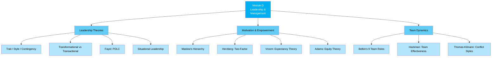

# D — Leadership, Management & Supervision (20%)

## 📑 Chapter List

| Ref | Chapter | Core Concepts | Exam Weight | Status |
|:---|:---|:---|:---:|:---:|
| D1 | [[D1-Leadership|Leadership Theories]] | Trait / Style / Contingency / Transformational | 7% | ⬜ |
| D2 | [[D2-Motivation|Motivation & Empowerment]] | Maslow / Herzberg / Vroom / Adams | 7% | ⬜ |
| D3 | [[D3-Teams|Team Dynamics]] | Belbin / Hackman / Conflict Resolution | 6% | ⬜ |

---

## 🔗 Cross-Module Links

- D1 (Leadership) + E1 (Ethics) → Ethical responsibility of leaders
- D2 (Motivation) + C5 (Appraisal) + C6 (Reward) → Motivation-Appraisal-Reward triangle
- D3 (Teams) + B4 (Projects) → Project team effectiveness
- D2 (Goal-Setting) + Psychology Domain → Behavioural change

---

> Return to [[../F1-Home|F1 Home]]
