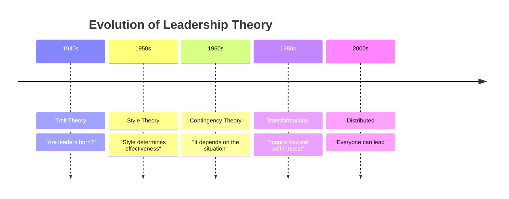
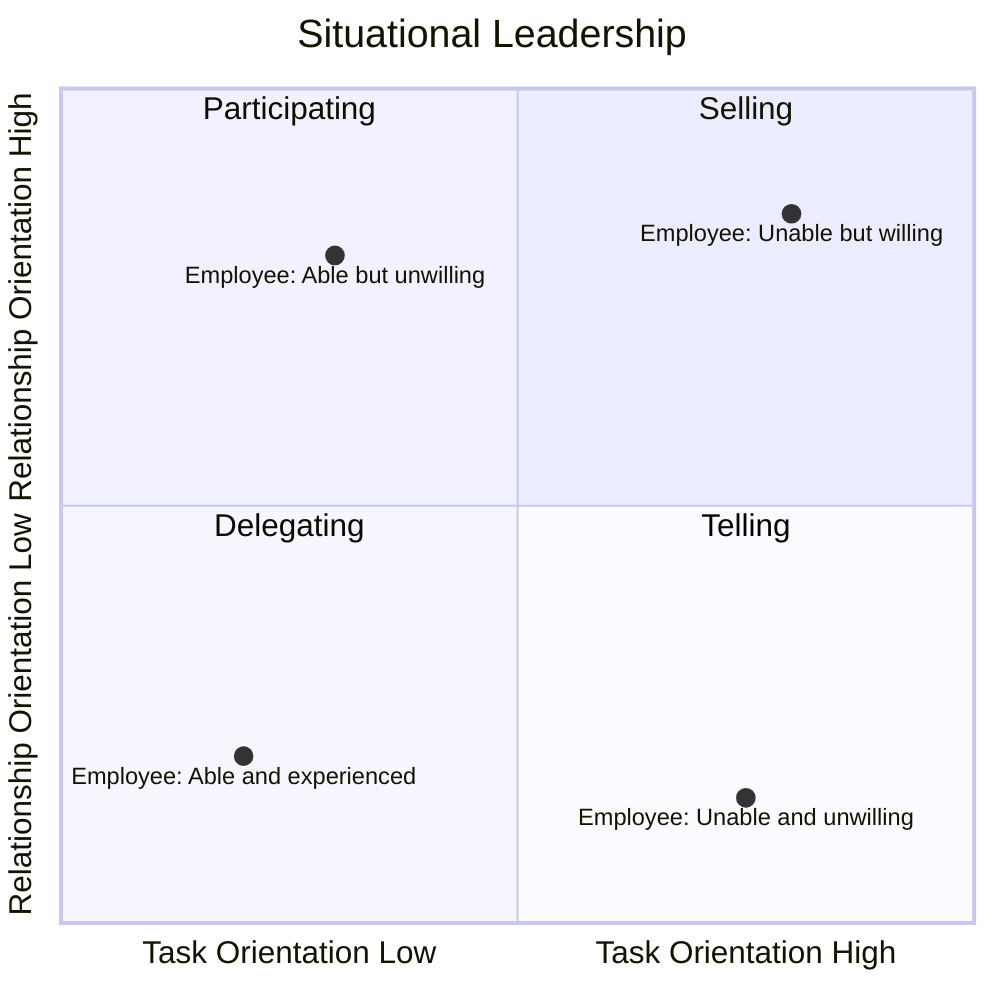

# D1 — Leadership Theories

> ⭐ Theory-dense | Comparative memorisation is key

---

## 🆚 Leadership vs Management

|  | Leadership | Management |
|:---|:---|:---|
| **Focus** | "Doing the right things" | "Doing things right" |
| **Driver** | Vision | Rules |
| **Concern** | People, direction, change | Process, efficiency, stability |
| **Power Source** | Personal influence | Positional power |
| **Quote** | "Leaders do the right thing, managers do things right" — Warren Bennis |

⚠️ **Reality**: These are complementary, not opposing. The best managers have leadership qualities; the best leaders need management skills.

---

## 📜 Evolution of Leadership Theories

---

## 🎨 Style Theory

| Style | Characteristics | Best For | Risk |
|:---|:---|:---|:---|
| **Autocratic** | Solo decision-making, directive | Crisis, emergencies | Low morale |
| **Democratic** | Participative, team discussion | Need for consensus | Slow decisions |
| **Laissez-Faire** | Hands-off, minimal intervention | Highly skilled teams | Lack of direction |
| **Paternalistic** | "Fatherly", care + guidance | Traditional organisations | Dependency |

---

## 🌍 Contingency Theory

### Fiedler's Model

> Leadership effectiveness = Leadership style × Situational favourableness

| Situation | Recommended Style |
|:---|:---|
| Very favourable (good relations + structured task + strong power) | Task-oriented |
| Very unfavourable (poor relations + unstructured + weak power) | Task-oriented |
| Moderately favourable | Relationship-oriented |

### Hersey & Blanchard — Situational Leadership

| Style | Employee Readiness | Behaviour |
|:---|:---|:---|
| **Telling** | R1: Low ability + Low willingness | Clear instructions, close supervision |
| **Selling** | R2: Low ability + High willingness | Explain decisions, two-way communication |
| **Participating** | R3: High ability + Low willingness | Encourage participation, joint decisions |
| **Delegating** | R4: High ability + High willingness | Empower, hands-off |

---

## 🦋 Transformational vs Transactional Leadership

|  | Transformational | Transactional |
|:---|:---|:---|
| **Essence** | Inspires beyond self-interest | Exchange (reward/punishment) |
| **Means** | Idealised influence, Inspirational motivation, Intellectual stimulation, Individualised consideration | Contingent reward, Management by exception |
| **Effect** | Higher performance, satisfaction | Maintains status quo |

⚠️ **Not either/or**: The best leaders use both. Transactional is the baseline; Transformational is the ceiling.

---

## 📐 Fayol's POLC (Management Functions)

| Function | Content |
|:---|:---|
| **P**lanning | Set objectives, formulate plans |
| **O**rganising | Allocate resources, design structures |
| **L**eading | Motivate, communicate, direct |
| **C**ontrolling | Monitor, compare, correct |

---

## 🔗 Links

- Leadership → [[../A-Business-Organisation/A4-Culture|A4 Culture]] (style-culture fit)
- Transformational → [[D2-Motivation|D2 Intrinsic Motivation]]
- POLC → [[../B-Strategy-Technology/B1-Strategy|B1 Strategic Management]]
- Contingency → [[D3-Teams|D3 Different team stages require different leadership styles]]

---

> Return to [[D-Home|Module D Home]]
