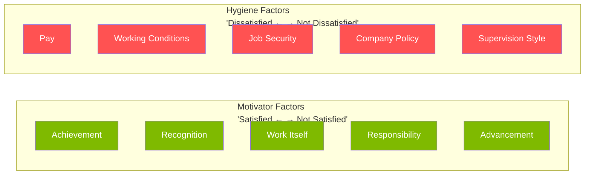

# D2 — Motivation & Empowerment

> ⭐ F1's most theory-dense chapter | Content Theories vs Process Theories

---

## 🧠 Content Theories (Focus on "What" People Need)

### Maslow's Hierarchy of Needs

```mermaid
graph TB
    SA[Self-Actualisation<br/>"Becoming the best version of oneself"]
    ESTEEM[Esteem<br/>"Recognition, achievement, status"]
    LOVE[Love / Belonging<br/>"Teams, relationships, belonging"]
    SAFETY[Safety<br/>"Job security, stability"]
    PHYSIO[Physiological<br/>"Pay, basic survival"]
    
    SA --> ESTEEM --> LOVE --> SAFETY --> PHYSIO
    
    classDef maslow fill:#00b0f0,color:#fff
    class SA,ESTEEM,LOVE,SAFETY,PHYSIO maslow
```

⚠️ **Criticism**: ① Is the hierarchy universal? (Cultural: collectivist cultures may place Belonging higher) ② Some sacrifice lower needs for higher ones (starving artists)

---

### Herzberg's Two-Factor Theory



> 💡 **Core insight**: More pay won't make people more satisfied (only removes dissatisfaction). True satisfaction comes from the work itself — meaning and growth.

---

### Other Content Theories

| Theory | Core Idea |
|:---|:---|
| **Alderfer's ERG** | Existence / Relatedness / Growth — simplified Maslow, no strict hierarchy |
| **McClelland** | Three needs: Achievement / Power / Affiliation |

---

## 🔄 Process Theories (Focus on "How" Motivation Works)

### Vroom's Expectancy Theory

> Motivation = **E**xpectancy × **I**nstrumentality × **V**alence

```mermaid
graph LR
    E[Expectancy<br/>Effort → Performance<br/>"If I try hard, can I achieve the target?"]
    I[Instrumentality<br/>Performance → Reward<br/>"If I achieve it, will I be rewarded?"]
    V[Valence<br/>Value of Reward<br/>"Does this reward matter to me?"]
    
    E --> M[Motivation]
    I --> M
    V --> M
    
    classDef vroom fill:#00b0f0,color:#fff
    class E,I,V,M vroom
```

⚠️ **Three factors multiply**: If any one is zero, total motivation is zero. When an employee isn't trying, the problem could be E, I, or V.

### Adams' Equity Theory

> People care not only about absolute rewards, but about **relative fairness** (own input/output ratio vs referent's ratio)

- **Under-reward** → Anger, reduced effort → Turnover
- **Over-reward** → Initial guilt → Cognitive adjustment (rationalisation)
- **Referents**: Colleagues (internal), industry peers (external), past self

---

## 🆓 Empowerment

> Not just "delegation", but making employees feel they have control over their work

**Preconditions**:
1. Competence — Employee is capable of making decisions
2. Information — Employee has information needed to decide
3. Trust — Organisation trusts employee's judgment
4. Boundaries — Clear scope and limits of empowerment

---

## 🔗 Links

- Maslow → [[../C-HRM/C6-Reward|C6 Pay matches physiological + safety needs]]
- Herzberg → [[../C-HRM/C6-Reward|C6 Pay is a Hygiene factor]]
- Vroom → [[../C-HRM/C5-Appraisal|C5 E×I×V directly affects appraisal effectiveness]]
- Equity → [[../C-HRM/C6-Reward|C6 Pay fairness perception]]
- Goal-Setting → Psychology Domain (behavioural change)

---

> Return to [[D-Home|Module D Home]]
