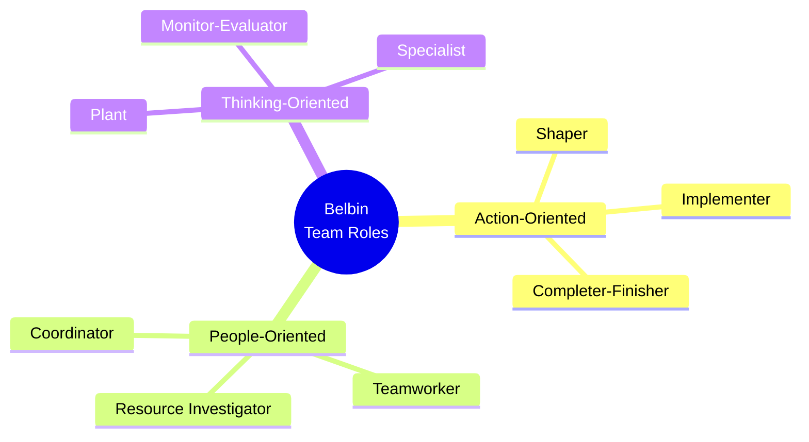
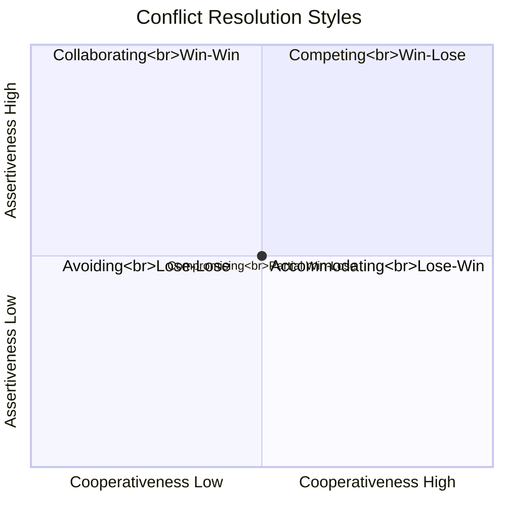

# D3 — Team Dynamics

---

## 🆚 Team vs Group

|  | Group | Team |
|:---|:---|:---|
| **Goal** | May differ individually | Shared common goal |
| **Interaction** | Loose | Close collaboration |
| **Accountability** | Individual | Individual + Collective |
| **Synergy** | 1+1=2 or less | 1+1>2 (Synergy) |

---

## 🎭 Belbin's 9 Team Roles

| Role | Characteristics | Allowable Weakness |
|:---|:---|:---|
| **Plant** 🌱 | Creative, unconventional | Ignores details, poor communicator |
| **Resource Investigator** 🔍 | Outgoing, explores opportunities | Loses interest after initial enthusiasm |
| **Coordinator** 🎯 | Mature, confident, chairs | May be seen as manipulative |
| **Shaper** ⚡ | Challenging, driving, thrives under pressure | Can offend people |
| **Monitor-Evaluator** 🤔 | Sober, strategic, judgment | Lacks inspiration |
| **Teamworker** 🤝 | Cooperative, mild, diplomatic | Indecisive in crunch moments |
| **Implementer** 🔧 | Disciplined, reliable, efficient | Inflexible |
| **Completer-Finisher** ✅ | Conscientious, perfectionist | Over-worries, reluctant to delegate |
| **Specialist** 📚 | Dedicated, deep technical knowledge | Narrow contribution scope |

⚠️ **Key insight**: ① No one needs all 9 roles ② A great team has complementary roles ③ One person can have secondary roles

---

## 🔬 Hackman's Team Effectiveness Model

| Condition | Description |
|:---|:---|
| **Real Team** | Genuine team (not nominal) |
| **Compelling Direction** | Inspiring direction/goal |
| **Enabling Structure** | Appropriate structure, roles, processes |
| **Supportive Context** | Supportive environment (resources, information, rewards) |
| **Expert Coaching** | Professional team coaching |

---

## ⚔️ Team Conflict

### Task vs Relationship Conflict

| Type | Nature | Impact |
|:---|:---|:---|
| **Task Conflict** | About "what" and "how" | ✅ Moderate amounts beneficial (sparks ideas) |
| **Relationship Conflict** | About "who" — personal friction | ❌ Always harmful |

---

### Thomas-Kilmann Conflict Resolution Styles

| Style | Strategy | Best For |
|:---|:---|:---|
| **Competing** | "I win, you lose" | Emergencies, principle matters |
| **Collaborating** | "Win-win" | Complex problems, integration needed |
| **Compromising** | "Split the difference" | Time pressure, equal power |
| **Avoiding** | "Don't engage" | Unimportant, need to cool down |
| **Accommodating** | "I lose, you win" | Relationship matters more, you're wrong |

---

## 🌐 Virtual Teams

| Challenge | Solution |
|:---|:---|
| Time zone differences | Async communication culture, core overlap hours |
| Communication misunderstandings | Use video, explicit expectations |
| Trust building | Regular 1-on-1s, virtual team building |
| Social Loafing | Clear individual deliverables, visible task boards |
| Cultural differences | Cultural sensitivity training |

---

## 🔗 Links

- Belbin → [[../C-HRM/C2-Recruitment|C2 Recruitment & Selection]]
- Tuckman → [[../C-HRM/C1-Behaviour|C1 Group Development]]
- Conflict → [[../E-Ethics/E3-Ethical-Conflict|E3 Ethical Conflict]]
- Virtual Teams → [[../C-HRM/C3-Diversity|C3 Diversity in Remote Work]]

---

> Return to [[D-Home|Module D Home]]
