# E — Professional Ethics (15%)

```mermaid
graph TB
    E[Module E<br/>Professional Ethics]
    E --> E1[Ethical Considerations in Business]
    E --> E2[ACCA Code of Conduct]
    E --> E3[Ethical Conflict & Resolution]
    
    E1 --> E1a[Deontology - Kant]
    E1 --> E1b[Utilitarianism - Bentham/Mill]
    E1 --> E1c[Virtue Ethics - Aristotle]
    E1 --> E1d[Tone at the Top]
    
    E2 --> E2a[Integrity]
    E2 --> E2b[Objectivity]
    E2 --> E2c[Competence & Due Care]
    E2 --> E2d[Confidentiality]
    E2 --> E2e[Professional Behaviour]
    E2 --> E2f[5 Threats + Safeguards]
    
    E3 --> E3a[Ethical Dilemma]
    E3 --> E3b[AAA Decision Framework]
    E3 --> E3c[Whistleblowing]
    E3 --> E3d[Professional Scepticism]
    
    classDef root fill:#ff5252,color:#fff
    classDef level1 fill:#ff7675,color:#000
    classDef level2 fill:#ffb3b3,color:#000
    
    class E root
    class E1,E2,E3 level1
    class E1a,E1b,E1c,E1d,E2a,E2b,E2c,E2d,E2e,E2f,E3a,E3b,E3c,E3d level2
```

## 📑 Chapter List

| Ref | Chapter | Core Concepts | Exam Weight | Status |
|:---|:---|:---|:---:|:---:|
| E1 | [[E1-Ethical-Considerations|Ethical Considerations]] | Deontology / Utilitarianism / Virtue | 5% | ⬜ |
| E2 | [[E2-Code-of-Conduct|ACCA Code of Conduct]] | 5 Principles / 5 Threats / Safeguards | 5% | ⬜ |
| E3 | [[E3-Ethical-Conflict|Ethical Conflict & Resolution]] | Dilemma / AAA Model / Whistleblowing | 5% | ⬜ |

---

## 🔗 Cross-Module Links

- E2 + A3 (Governance) → NED independence & professional ethics
- E2 + F8 (Audit) → Auditor's 5 threats
- E3 + D1 (Leadership) → Leader's ethical decision dilemmas
- E1 + Finance Domain → Ethical issues in behavioural finance

---

> Return to [[../F1-Home|F1 Home]]
