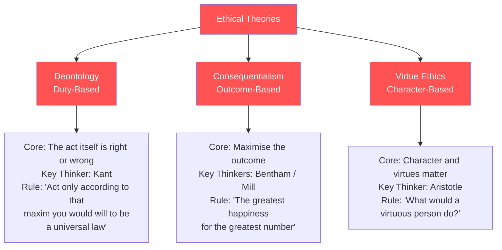

# E1 — Ethical Considerations in Business

---

## 🏛️ Three Major Ethical Theories

### Comparative Example: "Should we lay off 100 people to save the company?"

| Theory | Verdict | Reasoning |
|:---|:---|:---|
| **Deontology** | ❌ Should not | Using people as a means to an end (Kant prohibits) |
| **Utilitarianism** | ✅ Should | 100 jobs lost vs 1000 jobs saved → choose the greater good |
| **Virtue Ethics** | ⚠️ Depends | What would a virtuous leader do? (Compassion vs duty) |

---

## 🏢 Business Ethics Issues

| Issue | Description |
|:---|:---|
| **Bribery** | Offering money/gifts to obtain improper advantage |
| **Corruption** | Abuse of power for private gain |
| **Fraud** | Deliberate deception for unfair or unlawful gain |
| **Money Laundering** | Making illegally-obtained money appear legitimate |
| **Tax Avoidance** | Legal exploitation of tax loopholes to reduce tax liability |
| **Tax Evasion** | Illegal non-declaration or under-declaration of tax |

⚠️ **Grey area**: Tax Avoidance is legal, but is it ethical? (e.g. multinationals shifting profits to low-tax jurisdictions)

---

## 🔝 Tone at the Top

> An organisation's ethical culture is set by its highest level. "A fish rots from the head down."

**How it manifests**:
- Leaders' visible behaviour (actions speak louder than words)
- Genuine enforcement of the code of ethics (not just on the wall)
- Whether "bad news" is encouraged to be reported
- Consistency of consequences for ethical violations (regardless of rank)

---

## 🗣️ Whistleblowing

| Element | Description |
|:---|:---|
| **Definition** | An employee/insider exposes organisational wrongdoing |
| **Internal vs External** | Internal channels first; external (media/regulator) as last resort |
| **Legal Protection** | UK Public Interest Disclosure Act 1998, and equivalents |
| **Risks** | Retaliation, isolation, career damage → requires strong protection |

---

## 🔗 Links

- Deontology/Utilitarianism → [[E3-Ethical-Conflict|E3 Ethical Conflict Decision-Making]]
- Tone at the Top → [[../A-Business-Organisation/A3-Governance|A3 Corporate Governance]]
- Bribery/Corruption → [[E2-Code-of-Conduct|E2 ACCA Code — Integrity]]
- Tax Avoidance → F6 Taxation

---

> Return to [[E-Home|Module E Home]]
