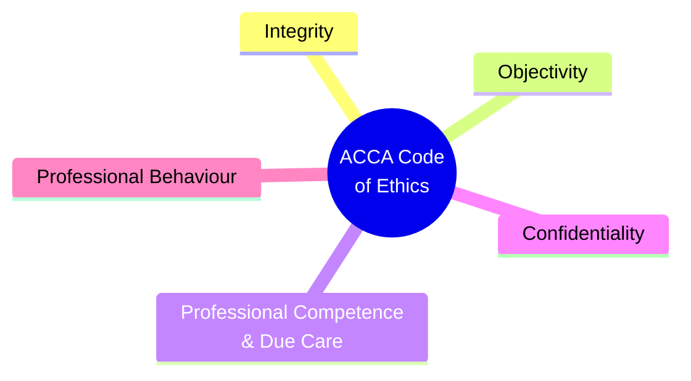

# E2 — ACCA Code of Ethics and Conduct

> ⭐ F1's most critical chapter | Foundation of ACCA membership | Most exam traps

---

## 🖐️ ACCA's Five Fundamental Principles



| # | Principle | Core Meaning | Violation Example |
|:---|:---|:---|:---|
| 1 | **Integrity** | Be honest and straightforward in all professional and business relationships | Falsifying accounts, misleading statements |
| 2 | **Objectivity** | Do not let bias, conflict of interest, or undue influence override professional judgment | Lowering audit standards due to personal relationship |
| 3 | **Professional Competence & Due Care** | Maintain professional knowledge and skill, act diligently | Failing to update knowledge, cutting corners |
| 4 | **Confidentiality** | Do not disclose information acquired through professional relationships | Sharing client financial data with friends |
| 5 | **Professional Behaviour** | Comply with laws and regulations, avoid discrediting the profession | Disparaging a client on social media |

---

## ⚡ Five Threats to Fundamental Principles

```mermaid
graph TB
    THREATS[Threats to Fundamental Principles]
    THREATS --> SI[Self-Interest<br/>"Financial interest in a client"]
    THREATS --> SR[Self-Review<br/>"Auditing your own work"]
    THREATS --> AD[Advocacy<br/>"Promoting a client's position"]
    THREATS --> FA[Familiarity<br/>"Too close to the client"]
    THREATS --> IN[Intimidation<br/>"Being pressured or threatened"]
    
    classDef threats fill:#ff5252,color:#fff
    class THREATS,SI,SR,AD,FA,IN threats
```

| Threat | Scenario | Example |
|:---|:---|:---|
| **Self-Interest** | Financial interest conflicts with professional judgment | Holding shares in an audit client |
| **Self-Review** | Evaluating your own previous work | Auditing an accounting system you designed |
| **Advocacy** | Promoting a client's position | Representing a client in court then auditing them |
| **Familiarity** | Too familiar to remain objective | Auditing the same client for 10 years, close friends with the CFO |
| **Intimidation** | Being pressured or threatened | Client threatens "change the opinion or we change the firm" |

---

## 🛡️ Safeguards

| Type | Measures |
|:---|:---|
| **Professional** | ACCA Code, CPD, professional training |
| **Legal / Regulatory** | Legal requirements, regulatory oversight |
| **Organisational** | Firm internal policies, quality reviews, rotation policies |

### Typical Safeguard Examples
- **Partner rotation** (addresses Familiarity threat)
- **Second partner review / independent review** (addresses Self-Review threat)
- **Prohibition on holding client shares** (addresses Self-Interest threat)
- **Separation of consulting and audit teams** (addresses Advocacy threat)
- **Ethics hotline** (addresses Intimidation threat)

---

## 📜 Law vs Ethics

> Legal ≠ Ethical. Ethical requirements often exceed the legal minimum.

| | Legal & Ethical | Legal but Unethical | Illegal but Ethical | Illegal & Unethical |
|:---|:---|:---|:---|:---|
| **Example** | Operating lawfully, paying tax | Tax Avoidance | Breaking lockdown to save a life | Fraud / Theft |

---

## 🔗 Links

- Integrity → [[E1-Ethical-Considerations|E1 Deontology]]
- Confidentiality → [[../B-Strategy-Technology/B2-IT|B2 GDPR]]
- Self-Review Threat → [[../A-Business-Organisation/A3-Governance|A3 NED Independence]]
- 5 Threats → F8 Audit (core threats faced by auditors)

---

> Return to [[E-Home|Module E Home]]
