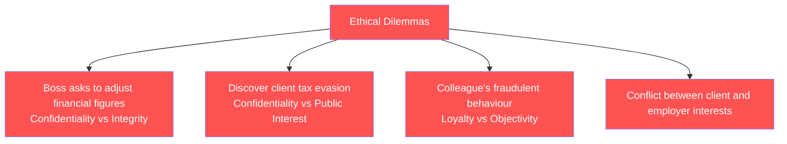
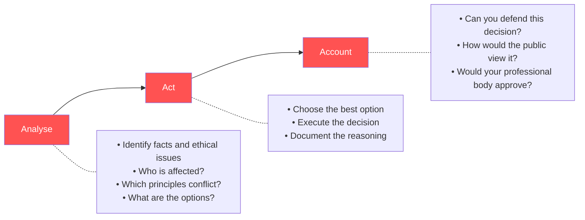
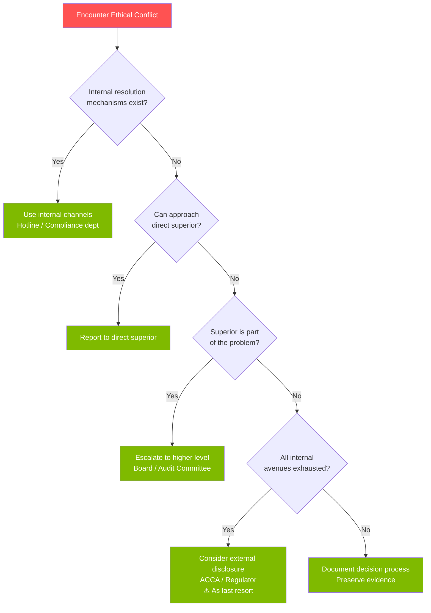

# E3 — Ethical Conflict & Resolution

---

## 🔀 Ethical Dilemma

> When two or more ethical principles (or interests) conflict, and any choice has a moral cost

### Typical Scenarios

---

## 🧭 AAA Ethical Decision-Making Framework

---

## 🛤️ Conflict Resolution Pathway

---

## 🗣️ Whistleblowing — Practical Considerations

### Steps
1. **Gather evidence** — Document facts (dates, individuals, actions)
2. **Internal channels** — Hotline, compliance, audit committee
3. **Professional body** — ACCA can provide guidance
4. **Legal protection** — Understand the protection laws in your jurisdiction
5. **External disclosure** — Last resort (media, regulator)

⚠️ **Reality check**: Many whistleblowers face professional and personal costs. Protection mechanisms are strong on paper, fragile in practice.

---

## 🔍 Professional Scepticism

> A questioning mind, alert to conditions that may indicate possible misstatement or fraud

| What It Is | What It Is Not |
|:---|:---|
| ✅ Questioning, verifying, thinking critically | ❌ Distrusting everything |
| ✅ Seeking evidence to support assertions | ❌ Cynicism |
| ✅ Staying alert to anomalies | ❌ Assuming everyone is lying |

---

## ⚖️ Consequences of Violating the ACCA Code

| Severity | Consequence |
|:---|:---|
| Minor violation | Warning, required corrective action |
| Moderate violation | Fine, additional CPD hours |
| Serious violation | Suspension of membership |
| Extremely serious | Permanent revocation of ACCA membership |

---

## 🔗 Links

- AAA Model → [[../D-Leadership/D1-Leadership|D1 Ethical Leadership]]
- Whistleblowing → [[../A-Business-Organisation/A3-Governance|A3 Audit Committee as key recipient]]
- Professional Scepticism → F8 Audit core
- Ethical Conflict → [[E1-Ethical-Considerations|E1 Three theories applied to actual decisions]]

---

> Return to [[E-Home|Module E Home]]
