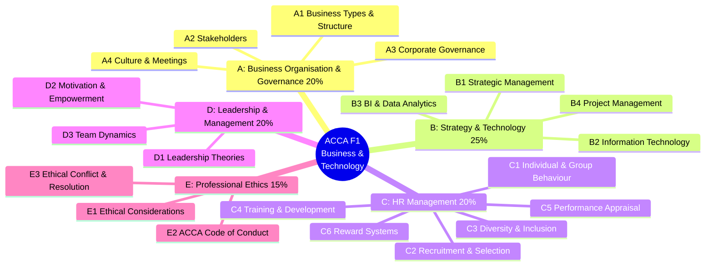
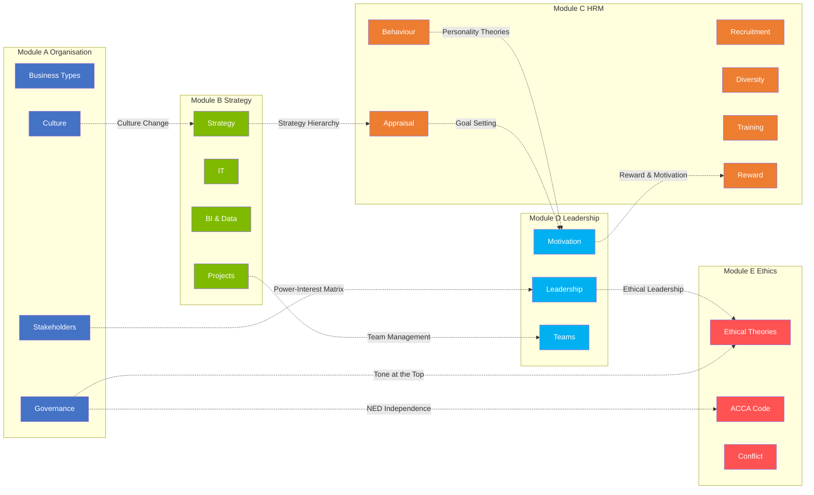
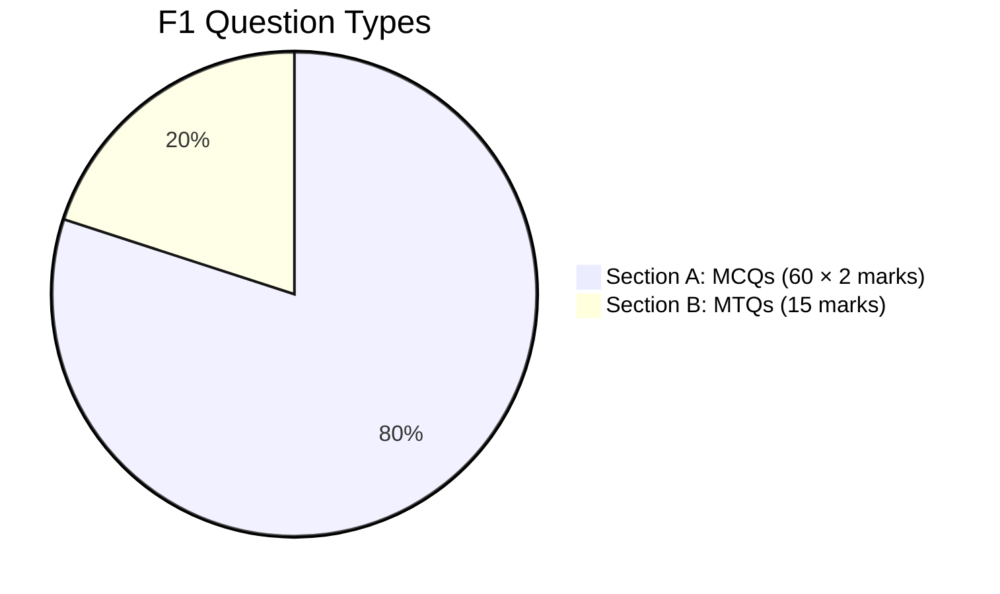
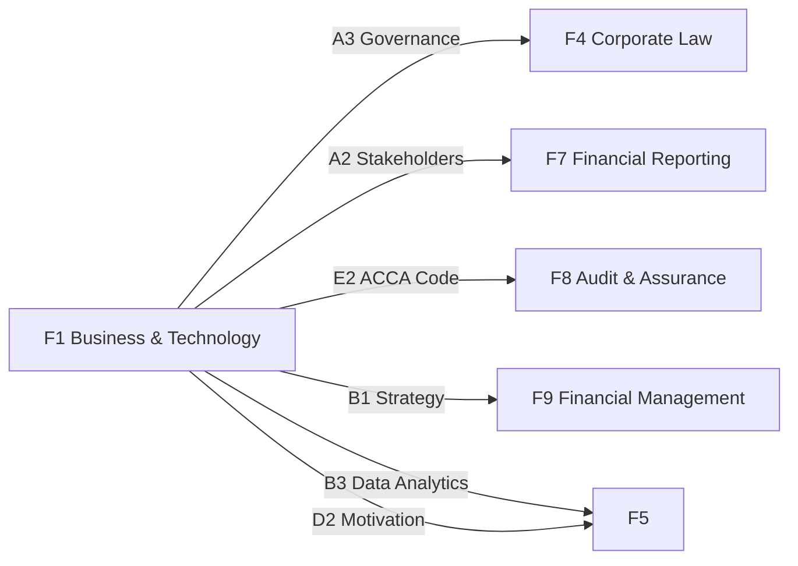

# 📚 ACCA F1 — Business and Technology (BT)

> **Formerly**: F1 Accountant in Business (AB)  
> **Position**: First paper in ACCA Applied Knowledge module — the panoramic map of the business world  
> **Nature**: Broad coverage, moderate depth — provides business context for F4/F7/F9

---

## 🗺️ F1 Knowledge Network

---

## 📑 Module Navigation

| Module | Syllabus Weight | Core Content | Status |
|:---|:---:|:---|:---:|
| [[../A-Business-Organisation/A-Home|A Business Organisation & Governance]] | 20% | Business types · Stakeholders · Governance · Culture | ⬜ |
| [[../B-Strategy-Technology/B-Home|B Strategy & Technology]] | 25% | Strategy · IT · Data Analytics · Projects | ⬜ |
| [[../C-HRM/C-Home|C Human Resource Management]] | 20% | Behaviour · Recruitment · Diversity · Training · Appraisal · Reward | ⬜ |
| [[../D-Leadership/D-Home|D Leadership & Management]] | 20% | Leadership · Motivation · Teams | ⬜ |
| [[../E-Ethics/E-Home|E Professional Ethics]] | 15% | Ethical Theories · ACCA Code · Conflict Resolution | ⬜ |

---

## 🏗️ Knowledge Network (Graph View)

---

## 🔑 Key Theory Index

| Theory | Module | Type | Links To |
|:---|:---|:---|:---|
| Porter's Five Forces | B1 | Strategic Analysis | → F9 Industry Analysis |
| SWOT Analysis | B1 | Strategic Analysis | → F5 Performance Management |
| Ansoff Matrix | B1 | Growth Strategy | → F9 Business Valuation |
| Mendelow's Matrix | A2 | Stakeholder Mgmt | → F4 Corporate Law |
| Maslow's Hierarchy | D2 | Motivation-Content | → Behavioural Finance |
| Herzberg's Two-Factor | D2 | Motivation-Content | → C6 Reward Design |
| Belbin's Team Roles | D3 | Team Dynamics | → B4 Project Management |
| Tuckman's Model | D3 | Team Development | → Organisational Change |
| Hofstede's Dimensions | A4 | Culture | → C3 Diversity |
| ACCA Code (5 Principles) | E2 | Professional Ethics | → F8 Audit |

---

## 📊 Exam Structure

- **Section A**: 60 Multiple Choice Questions, 2 marks each, covering all 5 modules
- **Section B**: ~6 scenario-based Multi-Task Questions, 2-3 sub-questions each
- **Characteristic**: Broad knowledge, no deep calculations, application-focused

---

## ➡️ Progression to Later Papers

---

## 📝 Note Conventions

| Tag | Meaning |
|:---|:---|
| ⚡ | Case — real-world application |
| ⚠️ | Comparison — IFRS vs VAS / Theory vs Practice |
| 💬 | Discussion — Daryl's insights and perspectives |
| ⭐ | Key — exam hot topic / practical critical |
| 🔗 | Cross-domain link |

---

> Return to [[../../../00-Overview/Home|Knowledge Network Home]]
