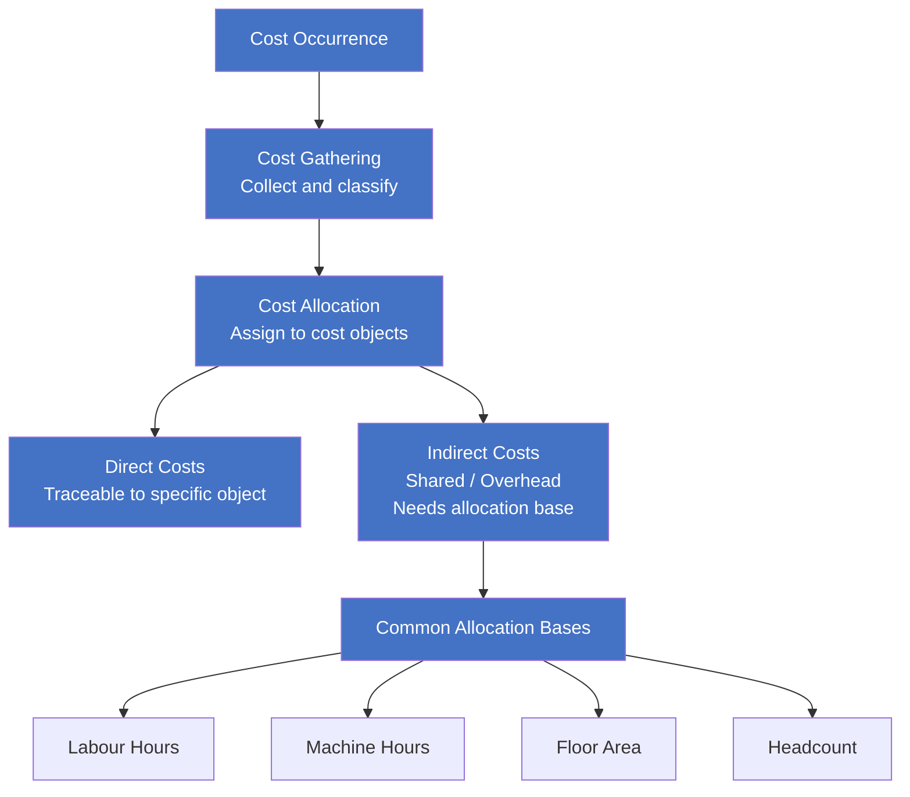

# Cost Allocation & Cost Gathering (成本归集)

> ⚠️ **Stub** — Content to be populated after Daryl discussion

---

## 📖 Definition

**Cost Allocation** (成本归集/分摊): The process of identifying, aggregating, and assigning costs to cost objects (products, departments, activities, projects).

**Cost Gathering** (成本归集): The initial collection and classification of costs before allocation.

---

## 🧩 Basic Framework

---

## 📊 Classification

### Direct vs Indirect Costs

| Type | Definition | Example |
|:---|:---|:---|
| **Direct Cost** | Traceable to specific cost object | Raw materials for a product |
| **Indirect Cost** | Shared, requires allocation base | Factory rent, supervisor salary |

### Common Allocation Bases

| Base | Best For |
|:---|:---|
| Labour Hours | Labour-intensive production |
| Machine Hours | Machine-intensive production |
| Floor Area | Rent, utilities allocation |
| Headcount | HR, admin cost allocation |

---

## 🔗 Related Topics

- F2 Management Accounting → cost classification and allocation methods
- F5 Performance Management → ABC (Activity-Based Costing)
- IFRS 16 Leases → [[../IFRS-16-Leases/IFRS-16-Leases|IFRS 16 Leases]]
- VAS comparison (to be developed)

---

## 📝 Daryl's Notes

> 📌 **To be discussed**: Daryl's practical experience with cost allocation in Vietnamese/Chinese enterprise context. Awaiting Daryl's input.

---

> Created: 2026-06-08 | Last updated: 2026-06-14
