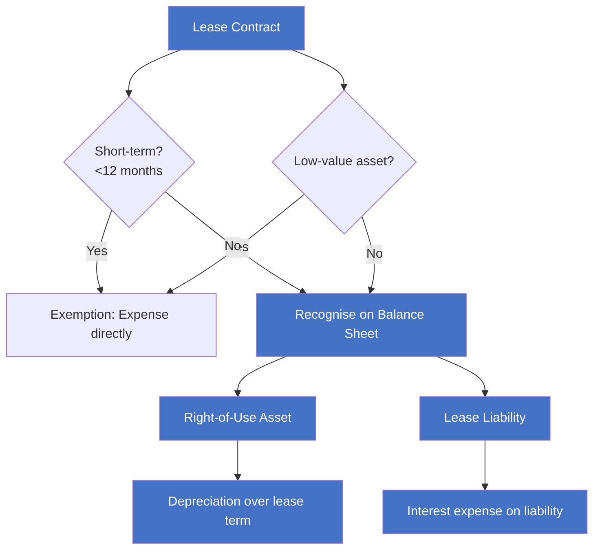
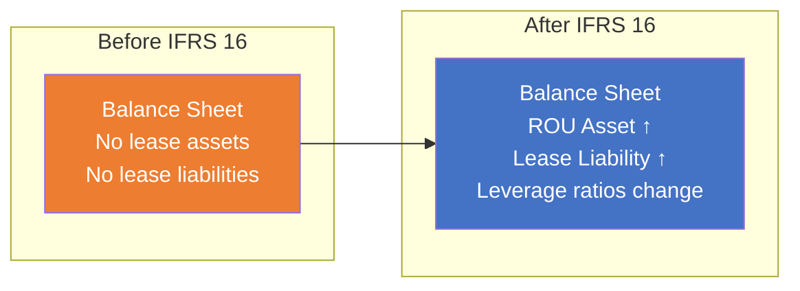

# IFRS 16 — Leases

> ⚡ Daryl's Practical Notes | 💬 Discussion with cross-domain cost allocation analysis

---

## 📖 Core Standard

**Effective**: 1 January 2019 (replaced IAS 17)  
**Key Change**: Eliminated the operating/finance lease distinction for lessees

### Before IFRS 16 (IAS 17 / Old Treatment)

```
Operating Lease:
  Dr. General & Administrative Expense  XXX
      Cr. Accounts Payable                    XXX
```

> Leases were "off-balance sheet" — no asset or liability recognized

### After IFRS 16 (Current Treatment)

```
At Lease Commencement:
  Dr. Right-of-Use Asset                XXX
      Cr. Lease Liability                     XXX
```

> All leases (with limited exemptions) now appear on the balance sheet

---

## 🧩 IFRS 16 Key Concepts

### Lessee Accounting



### Lease Liability Measurement

> Present Value of future lease payments, discounted at the implicit rate (or incremental borrowing rate)

| Component | Treatment |
|:---|:---|
| Fixed payments | Include in lease liability |
| Variable payments (index/rate based) | Include (remeasure when index changes) |
| Residual value guarantees | Include |
| Purchase options (reasonably certain) | Include |
| Termination penalties (reasonably certain) | Include |

---

## ⚡ Daryl's Practical Insights (2026-06-08)

### Tax Authority Intersection

> 💬 **Daryl's observation**: In Vietnam/China context, the tax bureau (税局) verifies assets based on quantity accounting metrics (按资产数量核算). The recognition of Right-of-Use assets under IFRS 16 creates a tension with local tax treatment.

**Key Tension Points**:

| Dimension | IFRS 16 | Local Tax Practice |
|:---|:---|:---|
| Asset Recognition | ROU Asset on balance sheet | Tax bureau may not recognize ROU |
| Expense Timing | Depreciation + Interest | May still allow straight-line lease expense deduction |
| Taxpayer Classification | N/A | Small-scale vs General taxpayer implications |

### Tax Authority & Practical Context

> 💬 **Daryl's observation**: Tax bureaus (税局) verify assets based on quantity accounting (按资产数量核算). ROU assets create a new category under IFRS 16 that may interact with local tax treatment.

> ⚠️ **Future research**: How Vietnamese enterprises reconcile IFRS 16 ROU recognition with local tax requirements and VAS.

---

## 📊 Balance Sheet Impact



### Key Ratio Impacts
- **Leverage (Debt/Equity)**: Increases (new liability)
- **EBITDA**: Improves (lease expense → depreciation + interest, which are below EBITDA line)
- **Asset Turnover**: Decreases (more assets on books)
- **ROA**: Initially decreases (new assets recognized, no revenue change)

---

## 🔗 Cross-References

- IFRS 16 → [[../../ACCA/F1-BT/A-Business-Organisation/A1-Business-Types|F1 A1 Business Types]] (leasing as a financing method for different entity types)

- IFRS 16 → F7 Financial Reporting (detailed IFRS 16 measurement)
- IFRS 16 → F9 Financial Management (lease vs buy decisions)
- ROU Asset → [[../../ACCA/F1-BT/A-Business-Organisation/A3-Governance|F1 A3 Governance]] (asset recognition controls)

---

## 📝 Daryl's Notes (from handwritten discussion)

- Page 1: Core IFRS 16 journal entries — old treatment (Dr Expense / Cr Payables) vs new treatment (Dr ROU Asset / Cr Lease Liability)
- Page 2: Tax intersection notes — tax bureau verification, small-scale vs general taxpayer, operating leasing contracts and asset confirmation

> 📌 **To be expanded**: Daryl to provide additional discussion on VAS lease treatment for comparison

---

> Created: 2026-06-08 | Source: Daryl's Samsung Tab S8 handwritten notes
